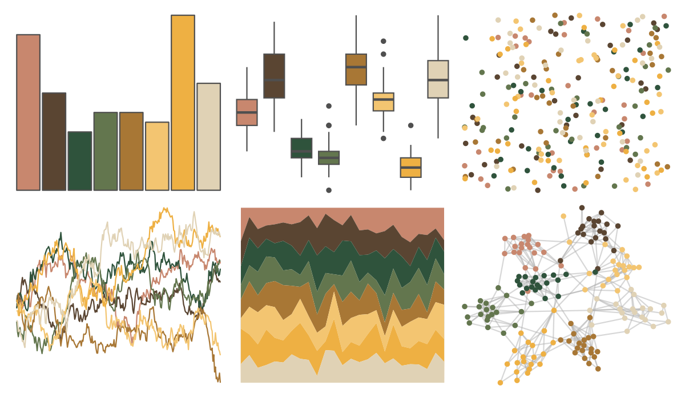

# IslamicArt - fes 

::: columns
::: {.column width="50%"}

**Github**

[lambdamoses/IslamicArt](https://github.com/lambdamoses/IslamicArt)
:::

::: {.column width="50%"}

**CRAN**

Not on CRAN
:::
:::

<hr> 

Use with [paletteer](https://emilhvitfeldt.github.io/paletteer/) package:

```r
library(paletteer)
paletteer_d("IslamicArt::fes")
```

Use raw:

```r
c("#C8876EFF", "#5A4532FF", "#2F533CFF", "#63764EFF", "#A87735FF", "#F3C571FF", "#EEB043FF", "#E0D2B5FF")
``` 

 

<br>

# Related Palettes

<div class="list" style="display: grid; grid-template-columns: auto auto auto;"> <figure class="figure">
<a href="../../amerika/Dem_Ind_Rep3/"> </a>
</figure> <figure class="figure">
<a href="../../rcartocolor/Fall/"> </a>
</figure> <figure class="figure">
<a href="../../tayloRswift/TLOAS/"> </a>
</figure> <figure class="figure">
<a href="../../MexBrewer/Ofrenda/"> </a>
</figure> <figure class="figure">
<a href="../../MetBrewer/Paquin/"> </a>
</figure> <figure class="figure">
<a href="../../PNWColors/Mushroom/"> </a>
</figure> <figure class="figure">
<a href="../../NatParksPalettes/SmokyMtns/"> </a>
</figure> <figure class="figure">
<a href="../../tayloRswift/fearless/"> </a>
</figure> <figure class="figure">
<a href="../../lisa/JohannJacobUlrich/"> </a>
</figure> <figure class="figure">
<a href="../../Manu/Titipounamu/"> </a>
</figure> <figure class="figure">
<a href="../../Redmonder/qMSOYlOr/"> </a>
</figure> <figure class="figure">
<a href="../../wesanderson/AsteroidCity1/"> </a>
</figure> 
</div>
