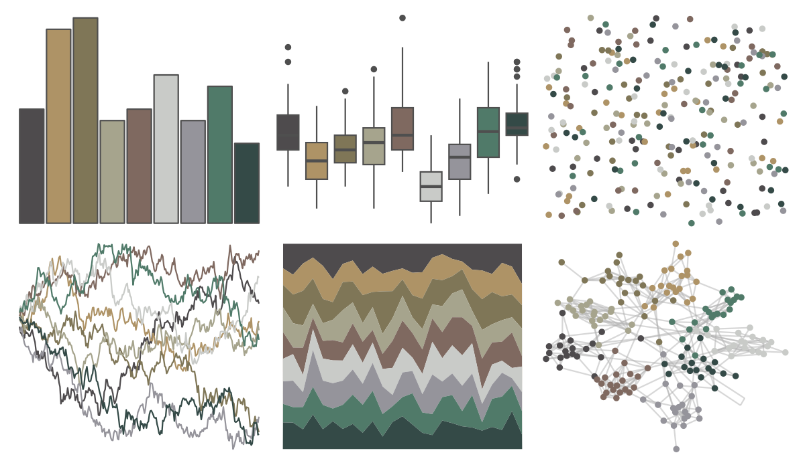

# IslamicArt - fes2 

::: columns
::: {.column width="50%"}

**Github**

[lambdamoses/IslamicArt](https://github.com/lambdamoses/IslamicArt)
:::

::: {.column width="50%"}

**CRAN**

Not on CRAN
:::
:::

<hr> 

Use with [paletteer](https://emilhvitfeldt.github.io/paletteer/) package:

```r
library(paletteer)
paletteer_d("IslamicArt::fes2")
```

Use raw:

```r
c("#4E4B4DFF", "#AE9366FF", "#7F7657FF", "#A6A48DFF", "#7F6960FF", "#C9CBC8FF", "#95949BFF", "#507A69FF", "#344A47FF")
``` 

 

<br>

# Related Palettes

<div class="list" style="display: grid; grid-template-columns: auto auto auto;"> <figure class="figure">
<a href="../../amerika/Dem_Ind_Rep3/"> </a>
</figure> <figure class="figure">
<a href="../../beyonce/X3/"> </a>
</figure> <figure class="figure">
<a href="../../IslamicArt/damascus/"> </a>
</figure> <figure class="figure">
<a href="../../fishualize/Lile_piquitinga/"> </a>
</figure> <figure class="figure">
<a href="../../Rdune/corrino/"> </a>
</figure> <figure class="figure">
<a href="../../fishualize/Alosa_fallax/"> </a>
</figure> <figure class="figure">
<a href="../../ggthemes/excel_View/"> </a>
</figure> <figure class="figure">
<a href="../../Manu/Kiwi/"> </a>
</figure> <figure class="figure">
<a href="../../impressionist.colors/les_terrassiers/"> </a>
</figure> <figure class="figure">
<a href="../../nord/algoma_forest/"> </a>
</figure> <figure class="figure">
<a href="../../MoMAColors/Picabia/"> </a>
</figure> <figure class="figure">
<a href="../../ochRe/parliament/"> </a>
</figure> 
</div>
