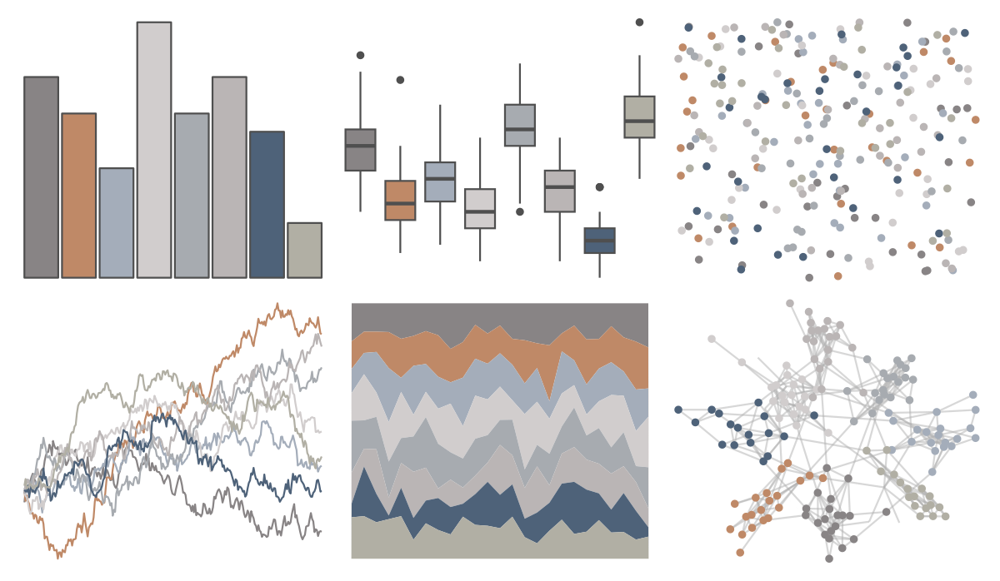
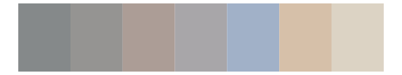

# IslamicArt - istanbul 

::: columns
::: {.column width="50%"}

**Github**

[lambdamoses/IslamicArt](https://github.com/lambdamoses/IslamicArt)
:::

::: {.column width="50%"}

**CRAN**

Not on CRAN
:::
:::

<hr> 

Use with [paletteer](https://emilhvitfeldt.github.io/paletteer/) package:

```r
library(paletteer)
paletteer_d("IslamicArt::istanbul")
```

Use raw:

```r
c("#888485FF", "#BF8967FF", "#A4ADBAFF", "#D1CDCDFF", "#A7ABB0FF", "#BAB5B5FF", "#4E6279FF", "#B1AFA4FF")
``` 

 

<br>

# Related Palettes

<div class="list" style="display: grid; grid-template-columns: auto auto auto;"> <figure class="figure">
<a href="../../awtools/a_palette/"> </a>
</figure> <figure class="figure">
<a href="../../fishualize/Atherinella_brasiliensis/"> </a>
</figure> <figure class="figure">
<a href="../../ghibli/TotoroLight/"> </a>
</figure> <figure class="figure">
<a href="../../palettetown/dewgong/"> </a>
</figure> <figure class="figure">
<a href="../../IslamicArt/abu_dhabi/"> </a>
</figure> <figure class="figure">
<a href="../../ggthemes/excel_Feathered/"> </a>
</figure> <figure class="figure">
<a href="../../fishualize/Ginglymostoma_cirratum/"> </a>
</figure> <figure class="figure">
<a href="../../fishualize/Mycteroperca_bonaci/"> </a>
</figure> <figure class="figure">
<a href="../../IslamicArt/damascus/"> </a>
</figure> <figure class="figure">
<a href="../../calecopal/casj/"> </a>
</figure> <figure class="figure">
<a href="../../nord/afternoon_prarie/"> </a>
</figure> <figure class="figure">
<a href="../../calecopal/collinsia/"> </a>
</figure> 
</div>
