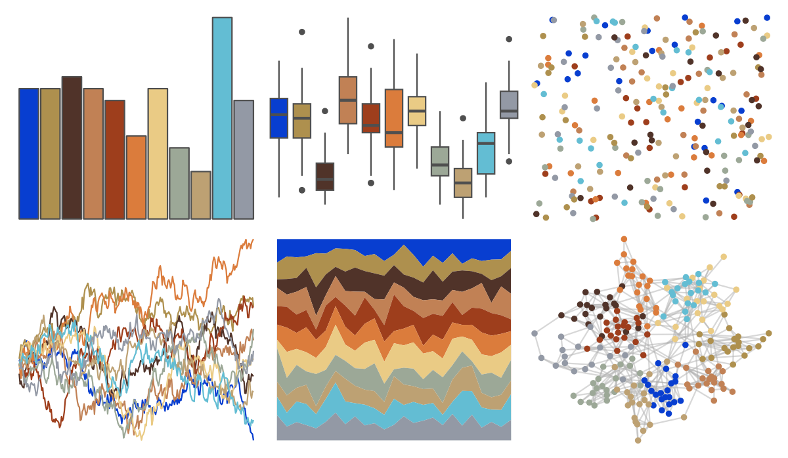

# IslamicArt - istanbul2 

::: columns
::: {.column width="50%"}

**Github**

[lambdamoses/IslamicArt](https://github.com/lambdamoses/IslamicArt)
:::

::: {.column width="50%"}

**CRAN**

Not on CRAN
:::
:::

<hr> 

Use with [paletteer](https://emilhvitfeldt.github.io/paletteer/) package:

```r
library(paletteer)
paletteer_d("IslamicArt::istanbul2")
```

Use raw:

```r
c("#083ED0FF", "#AE904EFF", "#503329FF", "#C18155FF", "#9E3E1CFF", "#DB7C3CFF", "#EACB85FF", "#9CA897FF", "#BDA173FF", "#63BDD3FF", "#9399A5FF")
``` 

 

<br>

# Related Palettes

<div class="list" style="display: grid; grid-template-columns: auto auto auto;"> <figure class="figure">
<a href="../../awtools/a_palette/"> </a>
</figure> <figure class="figure">
<a href="../../ButterflyColors/hamadryas_feronia/"> </a>
</figure> <figure class="figure">
<a href="../../ButterflyColors/hamadryas_feronia/"> </a>
</figure> <figure class="figure">
<a href="../../palettetown/vileplume/"> </a>
</figure> <figure class="figure">
<a href="../../IslamicArt/shiraz2/"> </a>
</figure> <figure class="figure">
<a href="../../trekcolors/lcars_nemesis/"> </a>
</figure> <figure class="figure">
<a href="../../MetBrewer/VanGogh2/"> </a>
</figure> <figure class="figure">
<a href="../../ggthemes/stata_s2color/"> </a>
</figure> <figure class="figure">
<a href="../../palettetown/gloom/"> </a>
</figure> <figure class="figure">
<a href="../../MetBrewer/Hokusai1/"> </a>
</figure> <figure class="figure">
<a href="../../werpals/jozi/"> </a>
</figure> <figure class="figure">
<a href="../../impressionist.colors/les_nympheas/"> </a>
</figure> 
</div>
