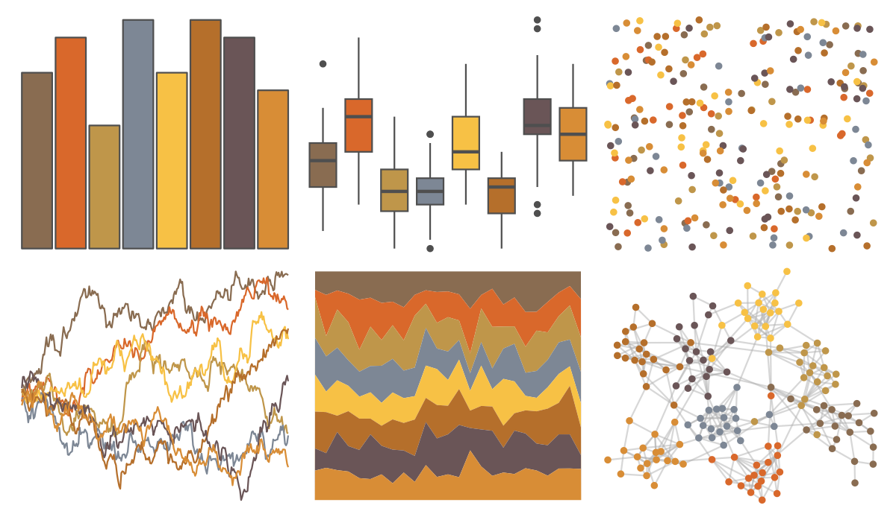

# IslamicArt - istanbul3 

::: columns
::: {.column width="50%"}

**Github**

[lambdamoses/IslamicArt](https://github.com/lambdamoses/IslamicArt)
:::

::: {.column width="50%"}

**CRAN**

Not on CRAN
:::
:::

<hr> 

Use with [paletteer](https://emilhvitfeldt.github.io/paletteer/) package:

```r
library(paletteer)
paletteer_d("IslamicArt::istanbul3")
```

Use raw:

```r
c("#896C51FF", "#D9682BFF", "#BF964AFF", "#7D8795FF", "#F7C145FF", "#B56F2BFF", "#6A5557FF", "#D88D36FF")
``` 

 

<br>

# Related Palettes

<div class="list" style="display: grid; grid-template-columns: auto auto auto;"> <figure class="figure">
<a href="../../amerika/Dem_Ind_Rep3/"> </a>
</figure> <figure class="figure">
<a href="../../IslamicArt/cordoba/"> </a>
</figure> <figure class="figure">
<a href="../../NatParksPalettes/Cuyahoga/"> </a>
</figure> <figure class="figure">
<a href="../../calecopal/dudleya/"> </a>
</figure> <figure class="figure">
<a href="../../palettetown/spinda/"> </a>
</figure> <figure class="figure">
<a href="../../ggpomological/pomological_palette/"> </a>
</figure> <figure class="figure">
<a href="../../Redmonder/qMSORd/"> </a>
</figure> <figure class="figure">
<a href="../../palettetown/magcargo/"> </a>
</figure> <figure class="figure">
<a href="../../ggthemes/excel_Red/"> </a>
</figure> <figure class="figure">
<a href="../../ggthemes/Winter/"> </a>
</figure> <figure class="figure">
<a href="../../Redmonder/qMSOYlOr/"> </a>
</figure> <figure class="figure">
<a href="../../ggthemes/excel_Parcel/"> </a>
</figure> 
</div>
