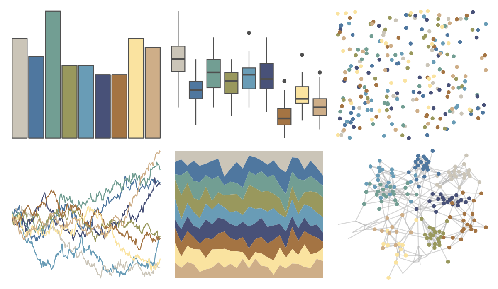

# IslamicArt - jerusalem 

::: columns
::: {.column width="50%"}

**Github**

[lambdamoses/IslamicArt](https://github.com/lambdamoses/IslamicArt)
:::

::: {.column width="50%"}

**CRAN**

Not on CRAN
:::
:::

<hr> 

Use with [paletteer](https://emilhvitfeldt.github.io/paletteer/) package:

```r
library(paletteer)
paletteer_d("IslamicArt::jerusalem")
```

Use raw:

```r
c("#CBC5B8FF", "#4F779FFF", "#729E93FF", "#99985DFF", "#699CB6FF", "#485178FF", "#A47443FF", "#FAE3A0FF", "#CEAE88FF")
``` 

 

<br>

# Related Palettes

<div class="list" style="display: grid; grid-template-columns: auto auto auto;"> <figure class="figure">
<a href="../../awtools/a_palette/"> </a>
</figure> <figure class="figure">
<a href="../../peRReo/rosalia/"> </a>
</figure> <figure class="figure">
<a href="../../ggthemes/Miller_Stone/"> </a>
</figure> <figure class="figure">
<a href="../../palettetown/hitmontop/"> </a>
</figure> <figure class="figure">
<a href="../../NatParksPalettes/SouthDowns/"> </a>
</figure> <figure class="figure">
<a href="../../Redmonder/qMSO15/"> </a>
</figure> <figure class="figure">
<a href="../../palettetown/seel/"> </a>
</figure> <figure class="figure">
<a href="../../ggsci/light_uchicago/"> </a>
</figure> <figure class="figure">
<a href="../../nationalparkcolors/CraterLake/"> </a>
</figure> <figure class="figure">
<a href="../../palettetown/hypno/"> </a>
</figure> <figure class="figure">
<a href="../../NatParksPalettes/Yellowstone/"> </a>
</figure> <figure class="figure">
<a href="../../ggthemes/Superfishel_Stone/"> </a>
</figure> 
</div>
