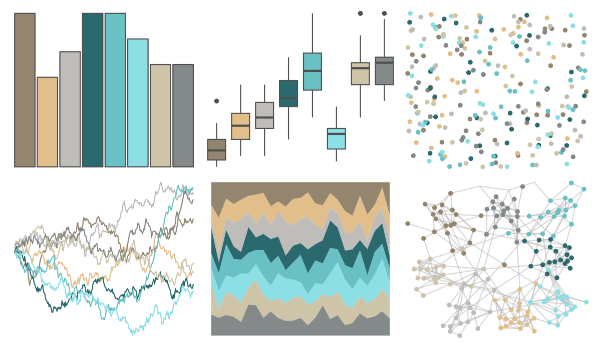

# IslamicArt - konya 

::: columns
::: {.column width="50%"}

**Github**

[lambdamoses/IslamicArt](https://github.com/lambdamoses/IslamicArt)
:::

::: {.column width="50%"}

**CRAN**

Not on CRAN
:::
:::

<hr> 

Use with [paletteer](https://emilhvitfeldt.github.io/paletteer/) package:

```r
library(paletteer)
paletteer_d("IslamicArt::konya")
```

Use raw:

```r
c("#94856EFF", "#E2BE8AFF", "#BFBDBAFF", "#2A696EFF", "#69C1C5FF", "#8BDFE5FF", "#CEC4A8FF", "#848A8AFF")
``` 

 

<br>

# Related Palettes

<div class="list" style="display: grid; grid-template-columns: auto auto auto;"> <figure class="figure">
<a href="../../amerika/Dem_Ind_Rep3/"> </a>
</figure> <figure class="figure">
<a href="../../ggthemes/excel_Feathered/"> </a>
</figure> <figure class="figure">
<a href="../../nord/algoma_forest/"> </a>
</figure> <figure class="figure">
<a href="../../IslamicArt/samarqand/"> </a>
</figure> <figure class="figure">
<a href="../../nationalparkcolors/CraterLake/"> </a>
</figure> <figure class="figure">
<a href="../../rcartocolor/Earth/"> </a>
</figure> <figure class="figure">
<a href="../../ltc/reading/"> </a>
</figure> <figure class="figure">
<a href="../../beyonce/X35/"> </a>
</figure> <figure class="figure">
<a href="../../beyonce/X54/"> </a>
</figure> <figure class="figure">
<a href="../../ggthemes/excel_Crop/"> </a>
</figure> <figure class="figure">
<a href="../../yarrr/info/"> </a>
</figure> <figure class="figure">
<a href="../../nord/afternoon_prarie/"> </a>
</figure> 
</div>
