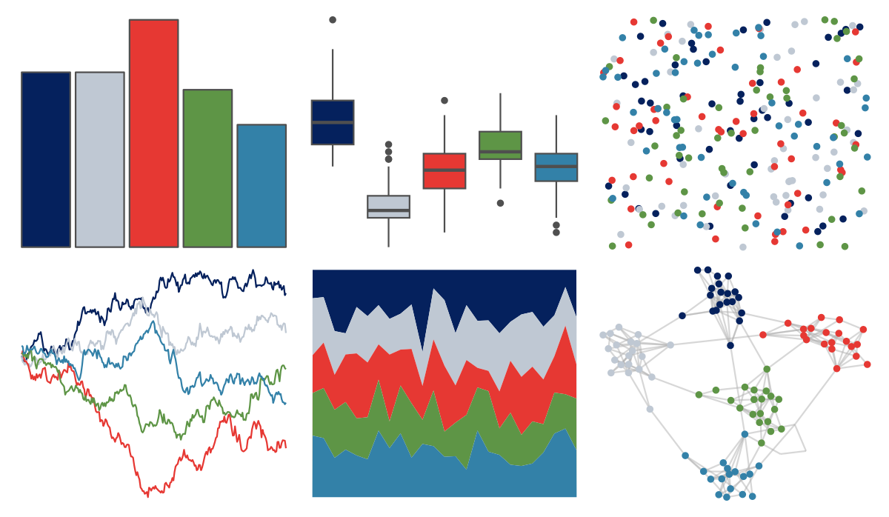

# IslamicArt - ottoman 

::: columns
::: {.column width="50%"}

**Github**

[lambdamoses/IslamicArt](https://github.com/lambdamoses/IslamicArt)
:::

::: {.column width="50%"}

**CRAN**

Not on CRAN
:::
:::

<hr> 

Use with [paletteer](https://emilhvitfeldt.github.io/paletteer/) package:

```r
library(paletteer)
paletteer_d("IslamicArt::ottoman")
```

Use raw:

```r
c("#05215DFF", "#BFC8D3FF", "#E63833FF", "#5E9546FF", "#3381A8FF")
``` 

 

<br>

# Related Palettes

<div class="list" style="display: grid; grid-template-columns: auto auto auto;"> <figure class="figure">
<a href="../../awtools/a_palette/"> </a>
</figure> <figure class="figure">
<a href="../../rockthemes/heep/"> </a>
</figure> <figure class="figure">
<a href="../../lisa/PaulFeeley/"> </a>
</figure> <figure class="figure">
<a href="../../Manu/Takahe/"> </a>
</figure> <figure class="figure">
<a href="../../fishualize/Hypsoblennius_invemar/"> </a>
</figure> <figure class="figure">
<a href="../../lisa/MarcChagall/"> </a>
</figure> <figure class="figure">
<a href="../../rockthemes/nodoubt/"> </a>
</figure> <figure class="figure">
<a href="../../suffrager/oxon/"> </a>
</figure> <figure class="figure">
<a href="../../NatParksPalettes/Triglav/"> </a>
</figure> <figure class="figure">
<a href="../../nbapalettes/knicks_city2/"> </a>
</figure> <figure class="figure">
<a href="../../DresdenColor/ghoststory/"> </a>
</figure> <figure class="figure">
<a href="../../nbapalettes/grizzlies_europe/"> </a>
</figure> 
</div>
