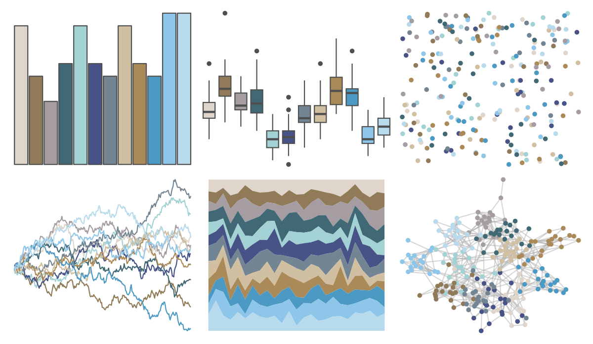

# IslamicArt - samarqand 

::: columns
::: {.column width="50%"}

**Github**

[lambdamoses/IslamicArt](https://github.com/lambdamoses/IslamicArt)
:::

::: {.column width="50%"}

**CRAN**

Not on CRAN
:::
:::

<hr> 

Use with [paletteer](https://emilhvitfeldt.github.io/paletteer/) package:

```r
library(paletteer)
paletteer_d("IslamicArt::samarqand")
```

Use raw:

```r
c("#DFD5CAFF", "#907A58FF", "#A59DA2FF", "#406975FF", "#A2D2D4FF", "#475286FF", "#738492FF", "#D1BFA2FF", "#AB8A5AFF", "#4C9AC4FF", "#8EC6E9FF", "#B7DAECFF")
``` 

 

<br>

# Related Palettes

<div class="list" style="display: grid; grid-template-columns: auto auto auto;"> <figure class="figure">
<a href="../../awtools/a_palette/"> </a>
</figure> <figure class="figure">
<a href="../../ButterflyColors/hamadryas_feronia/"> </a>
</figure> <figure class="figure">
<a href="../../ButterflyColors/hamadryas_feronia/"> </a>
</figure> <figure class="figure">
<a href="../../nord/afternoon_prarie/"> </a>
</figure> <figure class="figure">
<a href="../../nationalparkcolors/CraterLake/"> </a>
</figure> <figure class="figure">
<a href="../../palettetown/venomoth/"> </a>
</figure> <figure class="figure">
<a href="../../PrettyCols/Winter/"> </a>
</figure> <figure class="figure">
<a href="../../IslamicArt/abu_dhabi/"> </a>
</figure> <figure class="figure">
<a href="../../ltc/reading/"> </a>
</figure> <figure class="figure">
<a href="../../IslamicArt/konya/"> </a>
</figure> <figure class="figure">
<a href="../../palettetown/hitmontop/"> </a>
</figure> <figure class="figure">
<a href="../../palettetown/donphan/"> </a>
</figure> 
</div>
