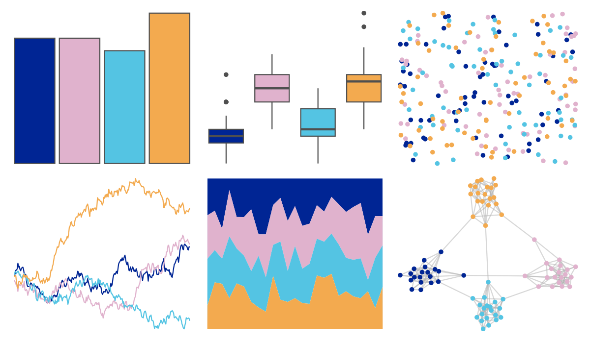

# IslamicArt - samarqand2 

::: columns
::: {.column width="50%"}

**Github**

[lambdamoses/IslamicArt](https://github.com/lambdamoses/IslamicArt)
:::

::: {.column width="50%"}

**CRAN**

Not on CRAN
:::
:::

<hr> 

Use with [paletteer](https://emilhvitfeldt.github.io/paletteer/) package:

```r
library(paletteer)
paletteer_d("IslamicArt::samarqand2")
```

Use raw:

```r
c("#002594FF", "#E0B2CDFF", "#54C4E3FF", "#F3AA4FFF")
``` 

 

<br>

# Related Palettes

<div class="list" style="display: grid; grid-template-columns: auto auto auto;"> <figure class="figure">
<a href="../../amerika/Dem_Ind_Rep3/"> </a>
</figure> <figure class="figure">
<a href="../../nbapalettes/grizzlies_00s/"> </a>
</figure> <figure class="figure">
<a href="../../PrettyCols/Bright/"> </a>
</figure> <figure class="figure">
<a href="../../rockthemes/nodoubt/"> </a>
</figure> <figure class="figure">
<a href="../../PrettyCols/Relax/"> </a>
</figure> <figure class="figure">
<a href="../../PrettyCols/Bold/"> </a>
</figure> <figure class="figure">
<a href="../../fishualize/Acanthurus_olivaceus/"> </a>
</figure> <figure class="figure">
<a href="../../nbapalettes/warriors_city2/"> </a>
</figure> <figure class="figure">
<a href="../../nbapalettes/grizzlies_europe/"> </a>
</figure> <figure class="figure">
<a href="../../fishualize/Epinephelus_lanceolatus/"> </a>
</figure> <figure class="figure">
<a href="../../PrettyCols/Fun/"> </a>
</figure> <figure class="figure">
<a href="../../fishualize/Scarus_quoyi/"> </a>
</figure> 
</div>
