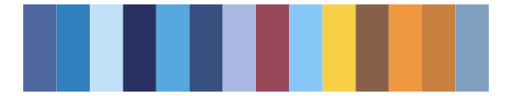
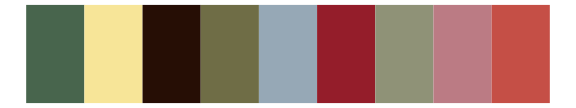

# IslamicArt - shiraz 

::: columns
::: {.column width="50%"}

**Github**

[lambdamoses/IslamicArt](https://github.com/lambdamoses/IslamicArt)
:::

::: {.column width="50%"}

**CRAN**

Not on CRAN
:::
:::

<hr> 

Use with [paletteer](https://emilhvitfeldt.github.io/paletteer/) package:

```r
library(paletteer)
paletteer_d("IslamicArt::shiraz")
```

Use raw:

```r
c("#402733FF", "#8F6052FF", "#2F6349FF", "#AE2B47FF", "#7BC17DFF", "#68D8F2FF", "#7982F7FF", "#E03E4AFF", "#FFF759FF", "#ECA987FF", "#705549FF", "#9F4739FF")
``` 

 

<br>

# Related Palettes

<div class="list" style="display: grid; grid-template-columns: auto auto auto;"> <figure class="figure">
<a href="../../awtools/a_palette/"> </a>
</figure> <figure class="figure">
<a href="../../MetBrewer/Signac/"> </a>
</figure> <figure class="figure">
<a href="../../peRReo/calle13/"> </a>
</figure> <figure class="figure">
<a href="../../palettetown/misdreavus/"> </a>
</figure> <figure class="figure">
<a href="../../rcartocolor/Vivid/"> </a>
</figure> <figure class="figure">
<a href="../../ggthemes/hc_default/"> </a>
</figure> <figure class="figure">
<a href="../../ggthemes/stata_s2color/"> </a>
</figure> <figure class="figure">
<a href="../../palettetown/sneasel/"> </a>
</figure> <figure class="figure">
<a href="../../ggsci/springfield_simpsons/"> </a>
</figure> <figure class="figure">
<a href="../../palettetown/swampert/"> </a>
</figure> <figure class="figure">
<a href="../../rcartocolor/Bold/"> </a>
</figure> <figure class="figure">
<a href="../../peRReo/shakira/"> </a>
</figure> 
</div>
