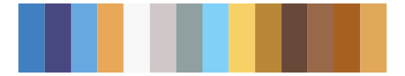
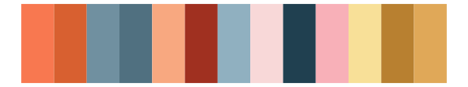

# IslamicArt - shiraz2 

::: columns
::: {.column width="50%"}

**Github**

[lambdamoses/IslamicArt](https://github.com/lambdamoses/IslamicArt)
:::

::: {.column width="50%"}

**CRAN**

Not on CRAN
:::
:::

<hr> 

Use with [paletteer](https://emilhvitfeldt.github.io/paletteer/) package:

```r
library(paletteer)
paletteer_d("IslamicArt::shiraz2")
```

Use raw:

```r
c("#8B633DFF", "#8A999DFF", "#C4B57CFF", "#CB4E33FF", "#F0D1A9FF", "#1B3F8AFF", "#68A1D3FF", "#AECCDFFF", "#D18860FF", "#30588BFF", "#C2944FFF", "#F9D073FF")
``` 

 

<br>

# Related Palettes

<div class="list" style="display: grid; grid-template-columns: auto auto auto;"> <figure class="figure">
<a href="../../awtools/a_palette/"> </a>
</figure> <figure class="figure">
<a href="../../palettetown/blastoise/"> </a>
</figure> <figure class="figure">
<a href="../../palettetown/wartortle/"> </a>
</figure> <figure class="figure">
<a href="../../palettetown/vileplume/"> </a>
</figure> <figure class="figure">
<a href="../../ggthemes/stata_s2color/"> </a>
</figure> <figure class="figure">
<a href="../../werpals/jozi/"> </a>
</figure> <figure class="figure">
<a href="../../palettetown/koffing/"> </a>
</figure> <figure class="figure">
<a href="../../ggthemes/Tableau_10/"> </a>
</figure> <figure class="figure">
<a href="../../IslamicArt/istanbul2/"> </a>
</figure> <figure class="figure">
<a href="../../palettetown/gloom/"> </a>
</figure> <figure class="figure">
<a href="../../palettetown/latias/"> </a>
</figure> <figure class="figure">
<a href="../../rcartocolor/Vivid/"> </a>
</figure> 
</div>
