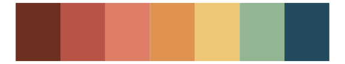

# LaCroixColoR - Apricot 

::: columns
::: {.column width="50%"}

**Github**

[johannesbjork/LaCroixColoR](https://github.com/johannesbjork/LaCroixColoR)
:::

::: {.column width="50%"}

**CRAN**

Not on CRAN
:::
:::

<hr> 

Use with [paletteer](https://emilhvitfeldt.github.io/paletteer/) package:

```r
library(paletteer)
paletteer_d("LaCroixColoR::Apricot")
```

Use raw:

```r
c("#D72000FF", "#EE6100FF", "#FFAD0AFF", "#1BB6AFFF", "#9093A2FF", "#132157FF")
``` 

 

<br>

# Related Palettes

<div class="list" style="display: grid; grid-template-columns: auto auto auto;"> <figure class="figure">
<a href="../../awtools/a_palette/"> </a>
</figure> <figure class="figure">
<a href="../../khroma/vibrant/"> </a>
</figure> <figure class="figure">
<a href="../../fishualize/Pronotogrammus_martinicensis/"> </a>
</figure> <figure class="figure">
<a href="../../nbapalettes/thunder_city/"> </a>
</figure> <figure class="figure">
<a href="../../fishualize/Pseudocheilinus_tetrataenia/"> </a>
</figure> <figure class="figure">
<a href="../../tvthemes/CrazyLaceAgate/"> </a>
</figure> <figure class="figure">
<a href="../../MetBrewer/Nizami/"> </a>
</figure> <figure class="figure">
<a href="../../MetBrewer/Cross/"> </a>
</figure> <figure class="figure">
<a href="../../Redmonder/qPBI/"> </a>
</figure> <figure class="figure">
<a href="../../MetBrewer/Archambault/"> </a>
</figure> <figure class="figure">
<a href="../../MetBrewer/Hokusai1/"> </a>
</figure> <figure class="figure">
<a href="../../lisa/EdvardMunch_1/"> </a>
</figure> 
</div>
