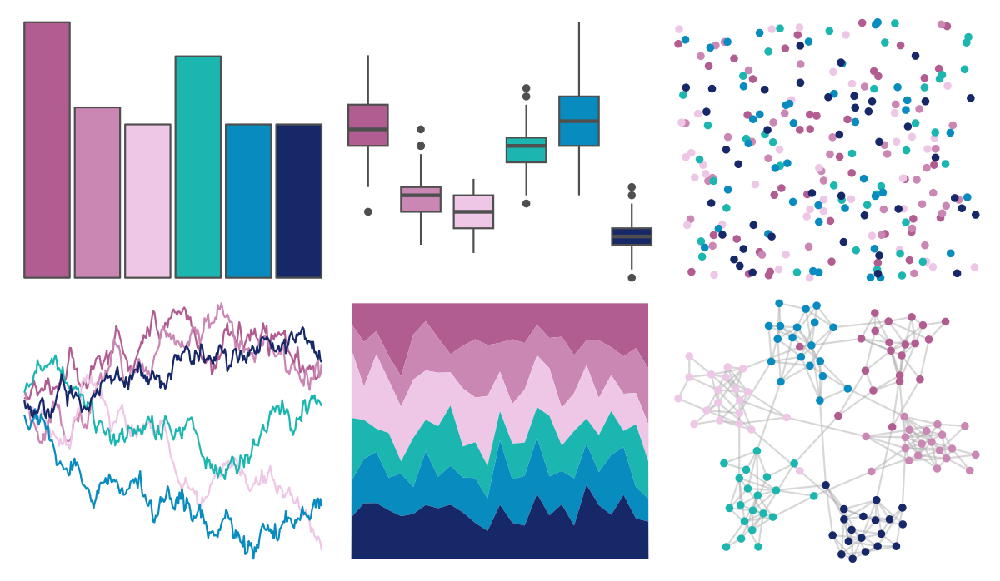

# LaCroixColoR - Berry 

::: columns
::: {.column width="50%"}

**Github**

[johannesbjork/LaCroixColoR](https://github.com/johannesbjork/LaCroixColoR)
:::

::: {.column width="50%"}

**CRAN**

Not on CRAN
:::
:::

<hr> 

Use with [paletteer](https://emilhvitfeldt.github.io/paletteer/) package:

```r
library(paletteer)
paletteer_d("LaCroixColoR::Berry")
```

Use raw:

```r
c("#B25D91FF", "#CB87B4FF", "#EFC7E6FF", "#1BB6AFFF", "#088BBEFF", "#172869FF")
``` 

 

<br>

# Related Palettes

<div class="list" style="display: grid; grid-template-columns: auto auto auto;"> <figure class="figure">
<a href="../../awtools/a_palette/"> </a>
</figure> <figure class="figure">
<a href="../../MapPalettes/tealberry_pie/"> </a>
</figure> <figure class="figure">
<a href="../../vapeplot/macplus/"> </a>
</figure> <figure class="figure">
<a href="../../vapoRwave/macPlus/"> </a>
</figure> <figure class="figure">
<a href="../../beyonce/X51/"> </a>
</figure> <figure class="figure">
<a href="../../RColorBrewer/BuPu/"> </a>
</figure> <figure class="figure">
<a href="../../fishualize/Scarus_globiceps/"> </a>
</figure> <figure class="figure">
<a href="../../futurevisions/europa/"> </a>
</figure> <figure class="figure">
<a href="../../beyonce/X49/"> </a>
</figure> <figure class="figure">
<a href="../../palettetown/wooper/"> </a>
</figure> <figure class="figure">
<a href="../../beyonce/X11/"> </a>
</figure> <figure class="figure">
<a href="../../LaCroixColoR/CranRaspberry/"> </a>
</figure> 
</div>
