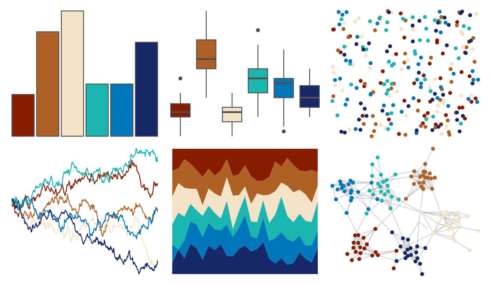

# LaCroixColoR - Coconut 

::: columns
::: {.column width="50%"}

**Github**

[johannesbjork/LaCroixColoR](https://github.com/johannesbjork/LaCroixColoR)
:::

::: {.column width="50%"}

**CRAN**

Not on CRAN
:::
:::

<hr> 

Use with [paletteer](https://emilhvitfeldt.github.io/paletteer/) package:

```r
library(paletteer)
paletteer_d("LaCroixColoR::Coconut")
```

Use raw:

```r
c("#881C00FF", "#AF6125FF", "#F4E3C7FF", "#1BB6AFFF", "#0076BBFF", "#172869FF")
``` 

 

<br>

# Related Palettes

<div class="list" style="display: grid; grid-template-columns: auto auto auto;"> <figure class="figure">
<a href="../../awtools/a_palette/"> </a>
</figure> <figure class="figure">
<a href="../../ButterflyColors/hamadryas_feronia/"> </a>
</figure> <figure class="figure">
<a href="../../ButterflyColors/hamadryas_feronia/"> </a>
</figure> <figure class="figure">
<a href="../../LaCroixColoR/PeachPear/"> </a>
</figure> <figure class="figure">
<a href="../../LaCroixColoR/Pamplemousse/"> </a>
</figure> <figure class="figure">
<a href="../../nbapalettes/grizzlies_europe/"> </a>
</figure> <figure class="figure">
<a href="../../futurevisions/atomic_clock/"> </a>
</figure> <figure class="figure">
<a href="../../ltc/heatmap/"> </a>
</figure> <figure class="figure">
<a href="../../fishualize/Hypsoblennius_invemar/"> </a>
</figure> <figure class="figure">
<a href="../../fishualize/Lampris_guttatus/"> </a>
</figure> <figure class="figure">
<a href="../../fishualize/Etheostoma_spectabile/"> </a>
</figure> <figure class="figure">
<a href="../../PrettyCols/Beach/"> </a>
</figure> 
</div>
