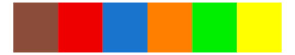

# LaCroixColoR - KeyLime 

::: columns
::: {.column width="50%"}

**Github**

[johannesbjork/LaCroixColoR](https://github.com/johannesbjork/LaCroixColoR)
:::

::: {.column width="50%"}

**CRAN**

Not on CRAN
:::
:::

<hr> 

Use with [paletteer](https://emilhvitfeldt.github.io/paletteer/) package:

```r
library(paletteer)
paletteer_d("LaCroixColoR::KeyLime")
```

Use raw:

```r
c("#D84D16FF", "#FFF800FF", "#8FDA04FF", "#009F3FFF", "#132157FF")
``` 

 

<br>

# Related Palettes

<div class="list" style="display: grid; grid-template-columns: auto auto auto;"> <figure class="figure">
<a href="../../awtools/a_palette/"> </a>
</figure> <figure class="figure">
<a href="../../LaCroixColoR/PommeBaya/"> </a>
</figure> <figure class="figure">
<a href="../../fishualize/Thalassoma_pavo/"> </a>
</figure> <figure class="figure">
<a href="../../RSkittleBrewer/original/"> </a>
</figure> <figure class="figure">
<a href="../../RSkittleBrewer/M_M/"> </a>
</figure> <figure class="figure">
<a href="../../fishualize/Holacanthus_ciliaris/"> </a>
</figure> <figure class="figure">
<a href="../../feathers/bee_eater/"> </a>
</figure> <figure class="figure">
<a href="../../yarrr/espresso/"> </a>
</figure> <figure class="figure">
<a href="../../fishualize/Halichoeres_garnoti/"> </a>
</figure> <figure class="figure">
<a href="../../fishualize/Antennarius_multiocellatus/"> </a>
</figure> <figure class="figure">
<a href="../../nbapalettes/bucks_city2/"> </a>
</figure> <figure class="figure">
<a href="../../ochRe/lorikeet/"> </a>
</figure> 
</div>
