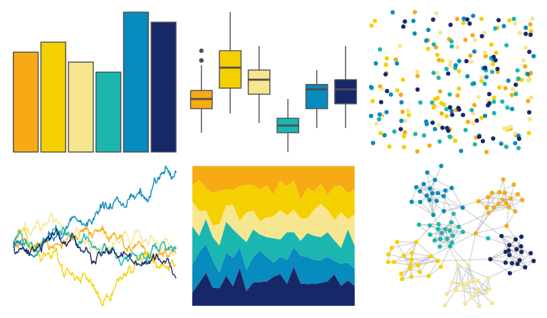

# LaCroixColoR - Lemon 

::: columns
::: {.column width="50%"}

**Github**

[johannesbjork/LaCroixColoR](https://github.com/johannesbjork/LaCroixColoR)
:::

::: {.column width="50%"}

**CRAN**

Not on CRAN
:::
:::

<hr> 

Use with [paletteer](https://emilhvitfeldt.github.io/paletteer/) package:

```r
library(paletteer)
paletteer_d("LaCroixColoR::Lemon")
```

Use raw:

```r
c("#F7AA14FF", "#F5D000FF", "#F7E690FF", "#1BB6AFFF", "#088BBEFF", "#172869FF")
``` 

 

<br>

# Related Palettes

<div class="list" style="display: grid; grid-template-columns: auto auto auto;"> <figure class="figure">
<a href="../../awtools/a_palette/"> </a>
</figure> <figure class="figure">
<a href="../../fishualize/Rhinecanthus_aculeatus/"> </a>
</figure> <figure class="figure">
<a href="../../feathers/bee_eater/"> </a>
</figure> <figure class="figure">
<a href="../../fishualize/Holacanthus_ciliaris/"> </a>
</figure> <figure class="figure">
<a href="../../rtist/vangogh/"> </a>
</figure> <figure class="figure">
<a href="../../LaCroixColoR/Orange/"> </a>
</figure> <figure class="figure">
<a href="../../fishualize/Stegastes_partitus/"> </a>
</figure> <figure class="figure">
<a href="../../MetBrewer/Isfahan2/"> </a>
</figure> <figure class="figure">
<a href="../../MetBrewer/Navajo/"> </a>
</figure> <figure class="figure">
<a href="../../jcolors/pal9/"> </a>
</figure> <figure class="figure">
<a href="../../fishualize/Hypoplectrus_puella/"> </a>
</figure> <figure class="figure">
<a href="../../fishualize/Coryphaena_hippurus/"> </a>
</figure> 
</div>
