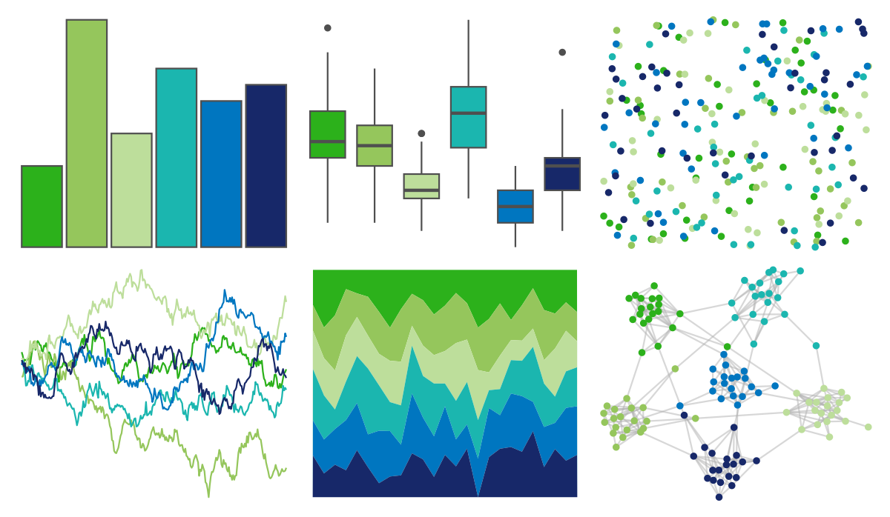

# LaCroixColoR - Lime 

::: columns
::: {.column width="50%"}

**Github**

[johannesbjork/LaCroixColoR](https://github.com/johannesbjork/LaCroixColoR)
:::

::: {.column width="50%"}

**CRAN**

Not on CRAN
:::
:::

<hr> 

Use with [paletteer](https://emilhvitfeldt.github.io/paletteer/) package:

```r
library(paletteer)
paletteer_d("LaCroixColoR::Lime")
```

Use raw:

```r
c("#2CB11BFF", "#95C65CFF", "#BDDE9BFF", "#1BB6AFFF", "#0076C0FF", "#172869FF")
``` 

 

<br>

# Related Palettes

<div class="list" style="display: grid; grid-template-columns: auto auto auto;"> <figure class="figure">
<a href="../../awtools/a_palette/"> </a>
</figure> <figure class="figure">
<a href="../../ggthemes/excel_Blue/"> </a>
</figure> <figure class="figure">
<a href="../../MapPalettes/green_machine/"> </a>
</figure> <figure class="figure">
<a href="../../rcartocolor/BluYl/"> </a>
</figure> <figure class="figure">
<a href="../../rcartocolor/Emrld/"> </a>
</figure> <figure class="figure">
<a href="../../Redmonder/qMSOBu/"> </a>
</figure> <figure class="figure">
<a href="../../MetBrewer/Hokusai3/"> </a>
</figure> <figure class="figure">
<a href="../../beyonce/X22/"> </a>
</figure> <figure class="figure">
<a href="../../fishualize/Elagatis_bipinnulata/"> </a>
</figure> <figure class="figure">
<a href="../../rcartocolor/ag_GrnYl/"> </a>
</figure> <figure class="figure">
<a href="../../NatParksPalettes/Denali/"> </a>
</figure> <figure class="figure">
<a href="../../RColorBrewer/YlGnBu/"> </a>
</figure> 
</div>
