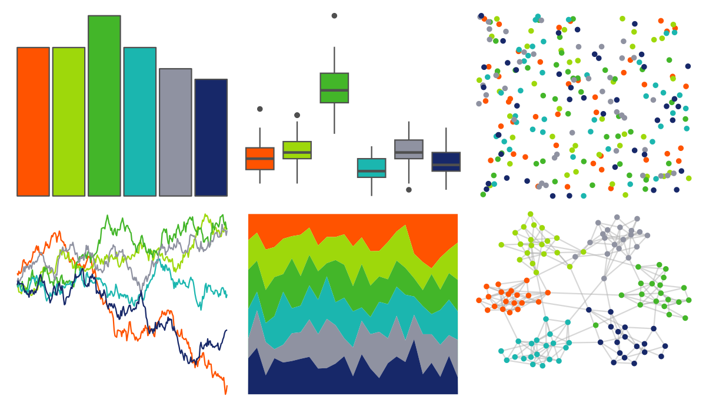

# LaCroixColoR - Mango 

::: columns
::: {.column width="50%"}

**Github**

[johannesbjork/LaCroixColoR](https://github.com/johannesbjork/LaCroixColoR)
:::

::: {.column width="50%"}

**CRAN**

Not on CRAN
:::
:::

<hr> 

Use with [paletteer](https://emilhvitfeldt.github.io/paletteer/) package:

```r
library(paletteer)
paletteer_d("LaCroixColoR::Mango")
```

Use raw:

```r
c("#FF5300FF", "#9ED80BFF", "#43B629FF", "#1BB6AFFF", "#8F92A1FF", "#172869FF")
``` 

 

<br>

# Related Palettes

<div class="list" style="display: grid; grid-template-columns: auto auto auto;"> <figure class="figure">
<a href="../../amerika/Dem_Ind_Rep3/"> </a>
</figure> <figure class="figure">
<a href="../../ggsci/default_frontiers/"> </a>
</figure> <figure class="figure">
<a href="../../ggsci/uniform_startrek/"> </a>
</figure> <figure class="figure">
<a href="../../LaCroixColoR/CeriseLimon/"> </a>
</figure> <figure class="figure">
<a href="../../palettetown/oddish/"> </a>
</figure> <figure class="figure">
<a href="../../ltc/crbhits/"> </a>
</figure> <figure class="figure">
<a href="../../nbapalettes/bucks_city2/"> </a>
</figure> <figure class="figure">
<a href="../../jcolors/pal9/"> </a>
</figure> <figure class="figure">
<a href="../../LaCroixColoR/Tangerine/"> </a>
</figure> <figure class="figure">
<a href="../../feathers/eastern_rosella/"> </a>
</figure> <figure class="figure">
<a href="../../fishualize/Koumansetta_rainfordi/"> </a>
</figure> <figure class="figure">
<a href="../../LaCroixColoR/PinaFraise/"> </a>
</figure> 
</div>
