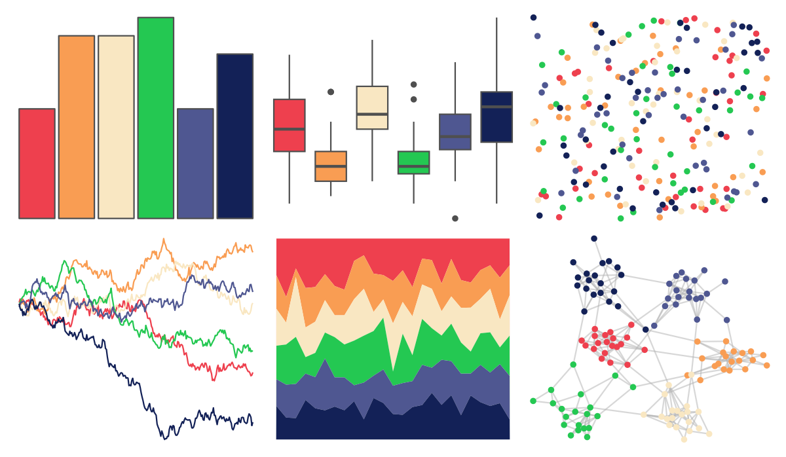

# LaCroixColoR - MelonPomelo 

::: columns
::: {.column width="50%"}

**Github**

[johannesbjork/LaCroixColoR](https://github.com/johannesbjork/LaCroixColoR)
:::

::: {.column width="50%"}

**CRAN**

Not on CRAN
:::
:::

<hr> 

Use with [paletteer](https://emilhvitfeldt.github.io/paletteer/) package:

```r
library(paletteer)
paletteer_d("LaCroixColoR::MelonPomelo")
```

Use raw:

```r
c("#EE404EFF", "#F99D53FF", "#F9E7C2FF", "#24C852FF", "#4F5791FF", "#132157FF")
``` 

 

<br>

# Related Palettes

<div class="list" style="display: grid; grid-template-columns: auto auto auto;"> <figure class="figure">
<a href="../../amerika/Dem_Ind_Rep3/"> </a>
</figure> <figure class="figure">
<a href="../../LaCroixColoR/KiwiSandia/"> </a>
</figure> <figure class="figure">
<a href="../../LaCroixColoR/PinaFraise/"> </a>
</figure> <figure class="figure">
<a href="../../Redmonder/qMSOSlp/"> </a>
</figure> <figure class="figure">
<a href="../../fishualize/Naso_lituratus/"> </a>
</figure> <figure class="figure">
<a href="../../peRReo/calle13/"> </a>
</figure> <figure class="figure">
<a href="../../jcolors/pal7/"> </a>
</figure> <figure class="figure">
<a href="../../awtools/mpalette/"> </a>
</figure> <figure class="figure">
<a href="../../RSkittleBrewer/smarties/"> </a>
</figure> <figure class="figure">
<a href="../../nationalparkcolors/DeathValley/"> </a>
</figure> <figure class="figure">
<a href="../../waRhol/bighorn_ram_83/"> </a>
</figure> <figure class="figure">
<a href="../../Redmonder/qMSO12/"> </a>
</figure> 
</div>
