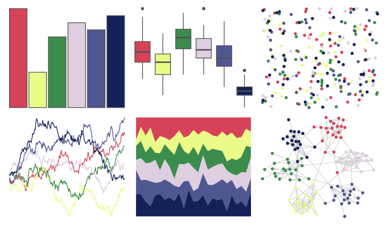

# LaCroixColoR - MurePepino 

::: columns
::: {.column width="50%"}

**Github**

[johannesbjork/LaCroixColoR](https://github.com/johannesbjork/LaCroixColoR)
:::

::: {.column width="50%"}

**CRAN**

Not on CRAN
:::
:::

<hr> 

Use with [paletteer](https://emilhvitfeldt.github.io/paletteer/) package:

```r
library(paletteer)
paletteer_d("LaCroixColoR::MurePepino")
```

Use raw:

```r
c("#D64358FF", "#EAFB88FF", "#3C8C4DFF", "#DFCEE0FF", "#4F5791FF", "#132157FF")
``` 

 

<br>

# Related Palettes

<div class="list" style="display: grid; grid-template-columns: auto auto auto;"> <figure class="figure">
<a href="../../awtools/a_palette/"> </a>
</figure> <figure class="figure">
<a href="../../LaCroixColoR/CeriseLimon/"> </a>
</figure> <figure class="figure">
<a href="../../lisa/PietMondrian/"> </a>
</figure> <figure class="figure">
<a href="../../LaCroixColoR/PassionFruit/"> </a>
</figure> <figure class="figure">
<a href="../../LaCroixColoR/KiwiSandia/"> </a>
</figure> <figure class="figure">
<a href="../../LaCroixColoR/MelonPomelo/"> </a>
</figure> <figure class="figure">
<a href="../../trekcolors/bajoran/"> </a>
</figure> <figure class="figure">
<a href="../../lisa/PerArnoldi/"> </a>
</figure> <figure class="figure">
<a href="../../colRoz/n_violacea/"> </a>
</figure> <figure class="figure">
<a href="../../NatParksPalettes/Volcanoes/"> </a>
</figure> <figure class="figure">
<a href="../../nbapalettes/grizzlies_europe/"> </a>
</figure> <figure class="figure">
<a href="../../RSkittleBrewer/wildberry/"> </a>
</figure> 
</div>
