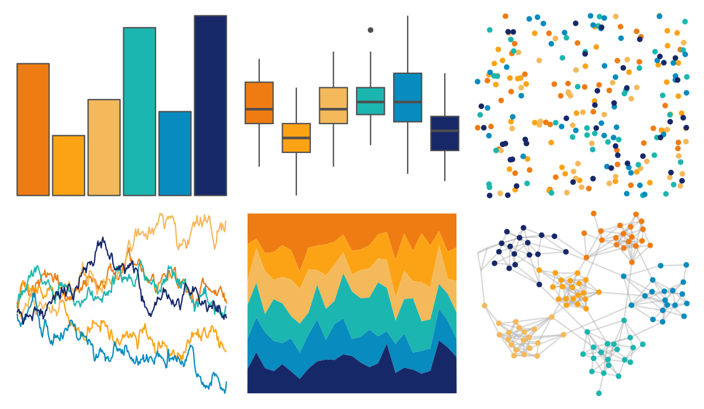

# LaCroixColoR - Orange 

::: columns
::: {.column width="50%"}

**Github**

[johannesbjork/LaCroixColoR](https://github.com/johannesbjork/LaCroixColoR)
:::

::: {.column width="50%"}

**CRAN**

Not on CRAN
:::
:::

<hr> 

Use with [paletteer](https://emilhvitfeldt.github.io/paletteer/) package:

```r
library(paletteer)
paletteer_d("LaCroixColoR::Orange")
```

Use raw:

```r
c("#EF7C12FF", "#FCA315FF", "#F4B95AFF", "#1BB6AFFF", "#088BBEFF", "#172869FF")
``` 

 

<br>

# Related Palettes

<div class="list" style="display: grid; grid-template-columns: auto auto auto;"> <figure class="figure">
<a href="../../awtools/a_palette/"> </a>
</figure> <figure class="figure">
<a href="../../MetBrewer/Navajo/"> </a>
</figure> <figure class="figure">
<a href="../../LaCroixColoR/PeachPear/"> </a>
</figure> <figure class="figure">
<a href="../../LaCroixColoR/Lemon/"> </a>
</figure> <figure class="figure">
<a href="../../PNWColors/Bay/"> </a>
</figure> <figure class="figure">
<a href="../../calecopal/kelp1/"> </a>
</figure> <figure class="figure">
<a href="../../palettetown/starterspairs/"> </a>
</figure> <figure class="figure">
<a href="../../LaCroixColoR/Coconut/"> </a>
</figure> <figure class="figure">
<a href="../../fishualize/Taeniura_lymma/"> </a>
</figure> <figure class="figure">
<a href="../../jcolors/pal7/"> </a>
</figure> <figure class="figure">
<a href="../../MetBrewer/Hiroshige/"> </a>
</figure> <figure class="figure">
<a href="../../fishualize/Hamulon_plumieri/"> </a>
</figure> 
</div>
