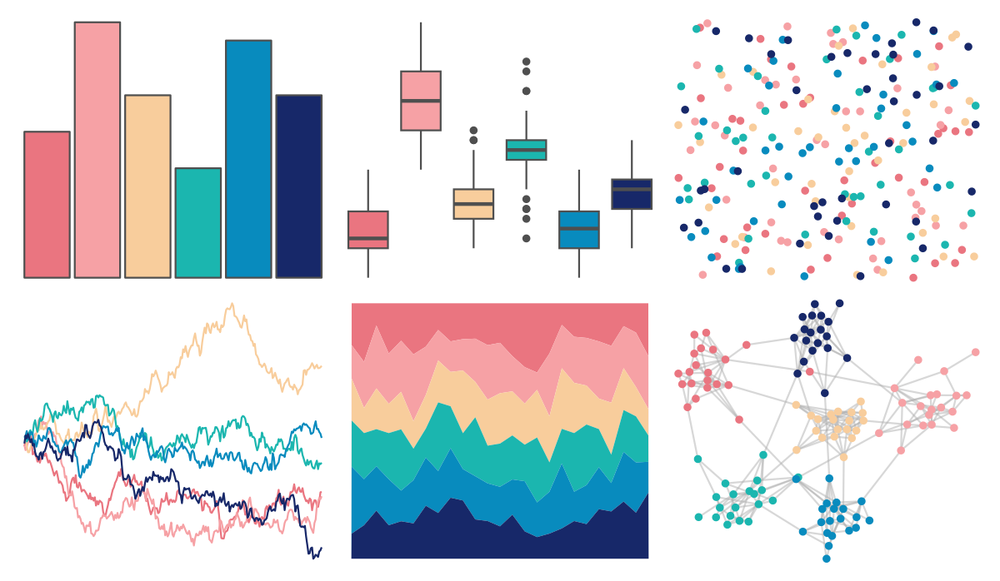

# LaCroixColoR - Pamplemousse 

::: columns
::: {.column width="50%"}

**Github**

[johannesbjork/LaCroixColoR](https://github.com/johannesbjork/LaCroixColoR)
:::

::: {.column width="50%"}

**CRAN**

Not on CRAN
:::
:::

<hr> 

Use with [paletteer](https://emilhvitfeldt.github.io/paletteer/) package:

```r
library(paletteer)
paletteer_d("LaCroixColoR::Pamplemousse")
```

Use raw:

```r
c("#EA7580FF", "#F6A1A5FF", "#F8CD9CFF", "#1BB6AFFF", "#088BBEFF", "#172869FF")
``` 

 

<br>

# Related Palettes

<div class="list" style="display: grid; grid-template-columns: auto auto auto;"> <figure class="figure">
<a href="../../awtools/a_palette/"> </a>
</figure> <figure class="figure">
<a href="../../LaCroixColoR/CranRaspberry/"> </a>
</figure> <figure class="figure">
<a href="../../beyonce/X2/"> </a>
</figure> <figure class="figure">
<a href="../../MetBrewer/Nizami/"> </a>
</figure> <figure class="figure">
<a href="../../LaCroixColoR/Coconut/"> </a>
</figure> <figure class="figure">
<a href="../../nbapalettes/grizzlies_europe/"> </a>
</figure> <figure class="figure">
<a href="../../fishualize/Lampris_guttatus/"> </a>
</figure> <figure class="figure">
<a href="../../werpals/alice/"> </a>
</figure> <figure class="figure">
<a href="../../tvthemes/Steven/"> </a>
</figure> <figure class="figure">
<a href="../../vapeplot/macplus/"> </a>
</figure> <figure class="figure">
<a href="../../vapoRwave/macPlus/"> </a>
</figure> <figure class="figure">
<a href="../../MetBrewer/Manet/"> </a>
</figure> 
</div>
