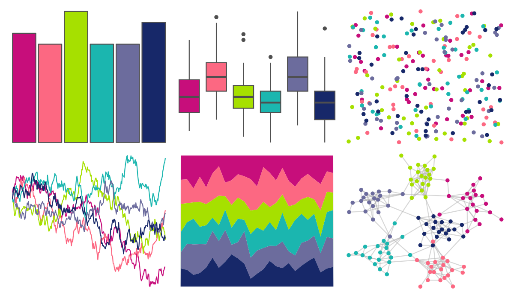

# LaCroixColoR - PassionFruit 

::: columns
::: {.column width="50%"}

**Github**

[johannesbjork/LaCroixColoR](https://github.com/johannesbjork/LaCroixColoR)
:::

::: {.column width="50%"}

**CRAN**

Not on CRAN
:::
:::

<hr> 

Use with [paletteer](https://emilhvitfeldt.github.io/paletteer/) package:

```r
library(paletteer)
paletteer_d("LaCroixColoR::PassionFruit")
```

Use raw:

```r
c("#C70E7BFF", "#FC6882FF", "#A6E000FF", "#1BB6AFFF", "#6C6C9DFF", "#172869FF")
``` 

 

<br>

# Related Palettes

<div class="list" style="display: grid; grid-template-columns: auto auto auto;"> <figure class="figure">
<a href="../../amerika/Dem_Ind_Rep3/"> </a>
</figure> <figure class="figure">
<a href="../../beyonce/X18/"> </a>
</figure> <figure class="figure">
<a href="../../MetBrewer/Austria/"> </a>
</figure> <figure class="figure">
<a href="../../jcolors/pal5/"> </a>
</figure> <figure class="figure">
<a href="../../vapoRwave/hyperBubble/"> </a>
</figure> <figure class="figure">
<a href="../../LaCroixColoR/MurePepino/"> </a>
</figure> <figure class="figure">
<a href="../../RSkittleBrewer/wildberry/"> </a>
</figure> <figure class="figure">
<a href="../../rockthemes/deelite/"> </a>
</figure> <figure class="figure">
<a href="../../khroma/muted/"> </a>
</figure> <figure class="figure">
<a href="../../pals/tol/"> </a>
</figure> <figure class="figure">
<a href="../../MoMAColors/Ohchi/"> </a>
</figure> <figure class="figure">
<a href="../../peRReo/ozuna/"> </a>
</figure> 
</div>
