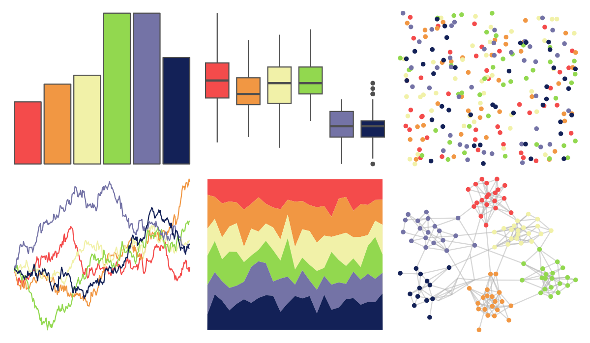

# LaCroixColoR - PinaFraise 

::: columns
::: {.column width="50%"}

**Github**

[johannesbjork/LaCroixColoR](https://github.com/johannesbjork/LaCroixColoR)
:::

::: {.column width="50%"}

**CRAN**

Not on CRAN
:::
:::

<hr> 

Use with [paletteer](https://emilhvitfeldt.github.io/paletteer/) package:

```r
library(paletteer)
paletteer_d("LaCroixColoR::PinaFraise")
```

Use raw:

```r
c("#F44B4BFF", "#F19743FF", "#F1F1A8FF", "#92D84FFF", "#7473A6FF", "#132157FF")
``` 

 

<br>

# Related Palettes

<div class="list" style="display: grid; grid-template-columns: auto auto auto;"> <figure class="figure">
<a href="../../awtools/a_palette/"> </a>
</figure> <figure class="figure">
<a href="../../ButterflyColors/hamadryas_feronia/"> </a>
</figure> <figure class="figure">
<a href="../../ButterflyColors/hamadryas_feronia/"> </a>
</figure> <figure class="figure">
<a href="../../LaCroixColoR/KiwiSandia/"> </a>
</figure> <figure class="figure">
<a href="../../LaCroixColoR/MelonPomelo/"> </a>
</figure> <figure class="figure">
<a href="../../jcolors/pal7/"> </a>
</figure> <figure class="figure">
<a href="../../awtools/mpalette/"> </a>
</figure> <figure class="figure">
<a href="../../fishualize/Naso_lituratus/"> </a>
</figure> <figure class="figure">
<a href="../../peRReo/calle13/"> </a>
</figure> <figure class="figure">
<a href="../../LaCroixColoR/CeriseLimon/"> </a>
</figure> <figure class="figure">
<a href="../../Redmonder/qMSOSlp/"> </a>
</figure> <figure class="figure">
<a href="../../lisa/PaulGauguin/"> </a>
</figure> 
</div>
