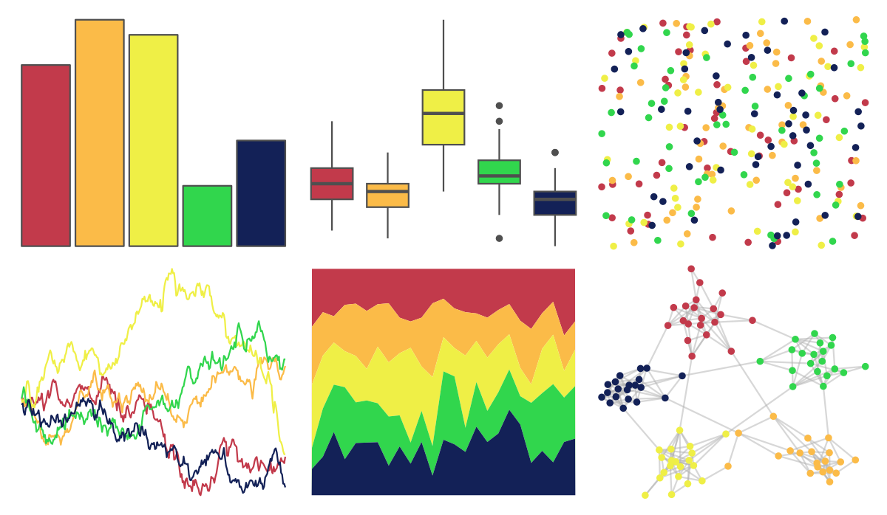

# LaCroixColoR - PommeBaya 

::: columns
::: {.column width="50%"}

**Github**

[johannesbjork/LaCroixColoR](https://github.com/johannesbjork/LaCroixColoR)
:::

::: {.column width="50%"}

**CRAN**

Not on CRAN
:::
:::

<hr> 

Use with [paletteer](https://emilhvitfeldt.github.io/paletteer/) package:

```r
library(paletteer)
paletteer_d("LaCroixColoR::PommeBaya")
```

Use raw:

```r
c("#C23A4BFF", "#FBBB48FF", "#EFEF46FF", "#31D64DFF", "#132157FF")
``` 

 

<br>

# Related Palettes

<div class="list" style="display: grid; grid-template-columns: auto auto auto;"> <figure class="figure">
<a href="../../awtools/a_palette/"> </a>
</figure> <figure class="figure">
<a href="../../ButterflyColors/hamadryas_feronia/"> </a>
</figure> <figure class="figure">
<a href="../../ButterflyColors/hamadryas_feronia/"> </a>
</figure> <figure class="figure">
<a href="../../fishualize/Thalassoma_pavo/"> </a>
</figure> <figure class="figure">
<a href="../../MoMAColors/Budnitz/"> </a>
</figure> <figure class="figure">
<a href="../../lisa/BillyApple/"> </a>
</figure> <figure class="figure">
<a href="../../LaCroixColoR/KeyLime/"> </a>
</figure> <figure class="figure">
<a href="../../LaCroixColoR/CeriseLimon/"> </a>
</figure> <figure class="figure">
<a href="../../fishualize/Holacanthus_ciliaris/"> </a>
</figure> <figure class="figure">
<a href="../../yarrr/espresso/"> </a>
</figure> <figure class="figure">
<a href="../../RSkittleBrewer/original/"> </a>
</figure> <figure class="figure">
<a href="../../lisa/PaulGauguin/"> </a>
</figure> 
</div>
