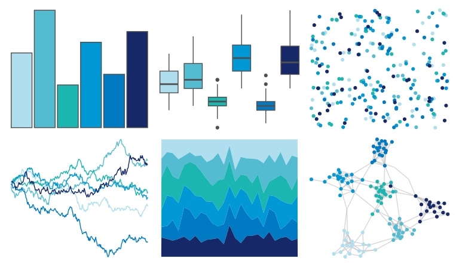

# LaCroixColoR - Pure 

::: columns
::: {.column width="50%"}

**Github**

[johannesbjork/LaCroixColoR](https://github.com/johannesbjork/LaCroixColoR)
:::

::: {.column width="50%"}

**CRAN**

Not on CRAN
:::
:::

<hr> 

Use with [paletteer](https://emilhvitfeldt.github.io/paletteer/) package:

```r
library(paletteer)
paletteer_d("LaCroixColoR::Pure")
```

Use raw:

```r
c("#AFDFEFFF", "#54BCD1FF", "#1BB6AFFF", "#0099D5FF", "#007BC3FF", "#172869FF")
``` 

 

<br>

# Related Palettes

<div class="list" style="display: grid; grid-template-columns: auto auto auto;"> <figure class="figure">
<a href="../../awtools/a_palette/"> </a>
</figure> <figure class="figure">
<a href="../../NatParksPalettes/Glacier/"> </a>
</figure> <figure class="figure">
<a href="../../fishualize/Prionace_glauca/"> </a>
</figure> <figure class="figure">
<a href="../../grDevices/blues9/"> </a>
</figure> <figure class="figure">
<a href="../../RColorBrewer/Blues/"> </a>
</figure> <figure class="figure">
<a href="../../palettetown/pineco/"> </a>
</figure> <figure class="figure">
<a href="../../rockthemes/coltrane/"> </a>
</figure> <figure class="figure">
<a href="../../ggsci/blue_material/"> </a>
</figure> <figure class="figure">
<a href="../../MetBrewer/Hokusai2/"> </a>
</figure> <figure class="figure">
<a href="../../ggsci/light_blue_material/"> </a>
</figure> <figure class="figure">
<a href="../../RColorBrewer/PuBu/"> </a>
</figure> <figure class="figure">
<a href="../../rcartocolor/DarkMint/"> </a>
</figure> 
</div>
