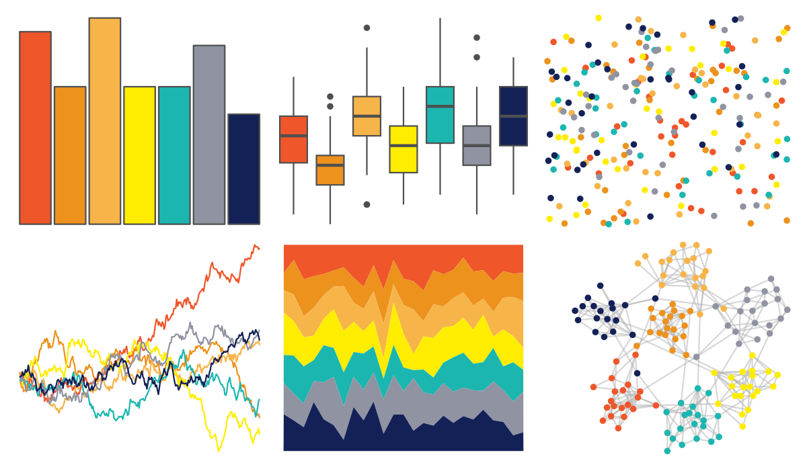

# LaCroixColoR - Tangerine 

::: columns
::: {.column width="50%"}

**Github**

[johannesbjork/LaCroixColoR](https://github.com/johannesbjork/LaCroixColoR)
:::

::: {.column width="50%"}

**CRAN**

Not on CRAN
:::
:::

<hr> 

Use with [paletteer](https://emilhvitfeldt.github.io/paletteer/) package:

```r
library(paletteer)
paletteer_d("LaCroixColoR::Tangerine")
```

Use raw:

```r
c("#EF562AFF", "#EC921DFF", "#F7B449FF", "#FFED00FF", "#1BB6AFFF", "#9093A2FF", "#132157FF")
``` 

 

<br>

# Related Palettes

<div class="list" style="display: grid; grid-template-columns: auto auto auto;"> <figure class="figure">
<a href="../../awtools/a_palette/"> </a>
</figure> <figure class="figure">
<a href="../../ButterflyColors/hamadryas_feronia/"> </a>
</figure> <figure class="figure">
<a href="../../ButterflyColors/hamadryas_feronia/"> </a>
</figure> <figure class="figure">
<a href="../../MetBrewer/VanGogh2/"> </a>
</figure> <figure class="figure">
<a href="../../jcolors/pal7/"> </a>
</figure> <figure class="figure">
<a href="../../ltc/crbhits/"> </a>
</figure> <figure class="figure">
<a href="../../yarrr/xmen/"> </a>
</figure> <figure class="figure">
<a href="../../LaCroixColoR/Mango/"> </a>
</figure> <figure class="figure">
<a href="../../colorblindr/OkabeIto/"> </a>
</figure> <figure class="figure">
<a href="../../LaCroixColoR/Apricot/"> </a>
</figure> <figure class="figure">
<a href="../../ggsci/default_frontiers/"> </a>
</figure> <figure class="figure">
<a href="../../LaCroixColoR/PinaFraise/"> </a>
</figure> 
</div>
