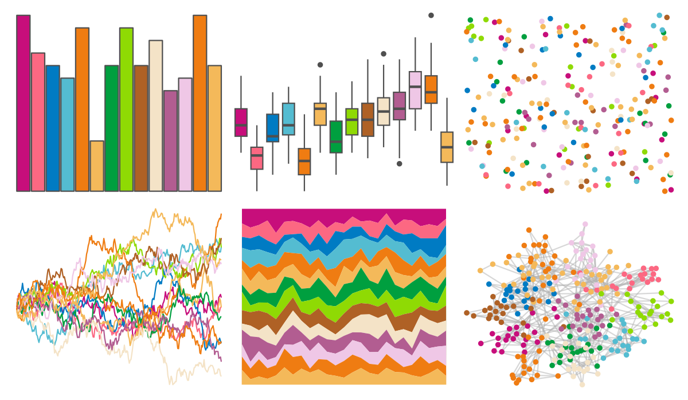
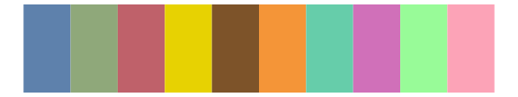

# LaCroixColoR - paired 

::: columns
::: {.column width="50%"}

**Github**

[johannesbjork/LaCroixColoR](https://github.com/johannesbjork/LaCroixColoR)
:::

::: {.column width="50%"}

**CRAN**

Not on CRAN
:::
:::

<hr> 

Use with [paletteer](https://emilhvitfeldt.github.io/paletteer/) package:

```r
library(paletteer)
paletteer_d("LaCroixColoR::paired")
```

Use raw:

```r
c("#C70E7BFF", "#FC6882FF", "#007BC3FF", "#54BCD1FF", "#EF7C12FF", "#F4B95AFF", "#009F3FFF", "#8FDA04FF", "#AF6125FF", "#F4E3C7FF", "#B25D91FF", "#EFC7E6FF", "#EF7C12FF", "#F4B95AFF")
``` 

 

<br>

# Related Palettes

<div class="list" style="display: grid; grid-template-columns: auto auto auto;"> <figure class="figure">
<a href="../../awtools/a_palette/"> </a>
</figure> <figure class="figure">
<a href="../../MetBrewer/Signac/"> </a>
</figure> <figure class="figure">
<a href="../../ggthemes/Classic_Cyclic/"> </a>
</figure> <figure class="figure">
<a href="../../basetheme/brutal/"> </a>
</figure> <figure class="figure">
<a href="../../RColorBrewer/Spectral/"> </a>
</figure> <figure class="figure">
<a href="../../ggsci/schwifty_rickandmorty/"> </a>
</figure> <figure class="figure">
<a href="../../trekcolors/lcars_2357/"> </a>
</figure> <figure class="figure">
<a href="../../basetheme/clean/"> </a>
</figure> <figure class="figure">
<a href="../../basetheme/void/"> </a>
</figure> <figure class="figure">
<a href="../../basetheme/minimal/"> </a>
</figure> <figure class="figure">
<a href="../../palettetown/lanturn/"> </a>
</figure> <figure class="figure">
<a href="../../RColorBrewer/Paired/"> </a>
</figure> 
</div>
