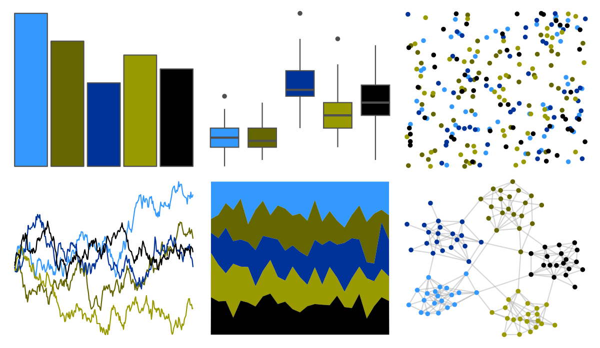
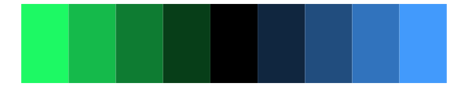

# Manu - Gloomy_Nudi 

::: columns
::: {.column width="50%"}

**Github**

[G-Thomson/Manu](https://github.com/G-Thomson/Manu)
:::

::: {.column width="50%"}

**CRAN**

Not on CRAN
:::
:::

<hr> 

Use with [paletteer](https://emilhvitfeldt.github.io/paletteer/) package:

```r
library(paletteer)
paletteer_d("Manu::Gloomy_Nudi")
```

Use raw:

```r
c("#3399FFFF", "#666600FF", "#003399FF", "#999900FF", "#000000FF")
``` 

 

<br>

# Related Palettes

<div class="list" style="display: grid; grid-template-columns: auto auto auto;"> <figure class="figure">
<a href="../../amerika/Dem_Ind_Rep3/"> </a>
</figure> <figure class="figure">
<a href="../../nbapalettes/bucks/"> </a>
</figure> <figure class="figure">
<a href="../../ochRe/nolan_ned/"> </a>
</figure> <figure class="figure">
<a href="../../nbapalettes/cavaliers/"> </a>
</figure> <figure class="figure">
<a href="../../nbapalettes/bucks_city/"> </a>
</figure> <figure class="figure">
<a href="../../tvthemes/Dark/"> </a>
</figure> <figure class="figure">
<a href="../../peRReo/eminem/"> </a>
</figure> <figure class="figure">
<a href="../../nbapalettes/mavericks_city/"> </a>
</figure> <figure class="figure">
<a href="../../nbapalettes/pacers_venue/"> </a>
</figure> <figure class="figure">
<a href="../../nbapalettes/warriors/"> </a>
</figure> <figure class="figure">
<a href="../../ggthemes/wsj_colors6/"> </a>
</figure> <figure class="figure">
<a href="../../trekcolors/romulan/"> </a>
</figure> 
</div>
