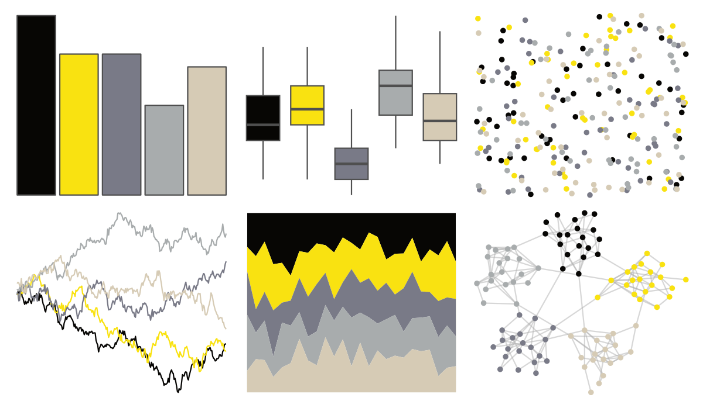

# Manu - Hihi 

::: columns
::: {.column width="50%"}

**Github**

[G-Thomson/Manu](https://github.com/G-Thomson/Manu)
:::

::: {.column width="50%"}

**CRAN**

Not on CRAN
:::
:::

<hr> 

Use with [paletteer](https://emilhvitfeldt.github.io/paletteer/) package:

```r
library(paletteer)
paletteer_d("Manu::Hihi")
```

Use raw:

```r
c("#070604FF", "#F9E211FF", "#797A87FF", "#A8ACADFF", "#D6CBB5FF")
``` 

 

<br>

# Related Palettes

<div class="list" style="display: grid; grid-template-columns: auto auto auto;"> <figure class="figure">
<a href="../../amerika/Dem_Ind_Rep3/"> </a>
</figure> <figure class="figure">
<a href="../../tvthemes/Greyjoy/"> </a>
</figure> <figure class="figure">
<a href="../../colRoz/n_violacea/"> </a>
</figure> <figure class="figure">
<a href="../../colRoz/s_spinigerus/"> </a>
</figure> <figure class="figure">
<a href="../../fishualize/Melichthys_vidua/"> </a>
</figure> <figure class="figure">
<a href="../../yarrr/ohbrother/"> </a>
</figure> <figure class="figure">
<a href="../../colRoz/n_levis/"> </a>
</figure> <figure class="figure">
<a href="../../lisa/JoanMiro/"> </a>
</figure> <figure class="figure">
<a href="../../calecopal/buow/"> </a>
</figure> <figure class="figure">
<a href="../../fishualize/Chaetodontoplus_conspicillatus/"> </a>
</figure> <figure class="figure">
<a href="../../palettetown/jolteon/"> </a>
</figure> <figure class="figure">
<a href="../../beyonce/X10/"> </a>
</figure> 
</div>
