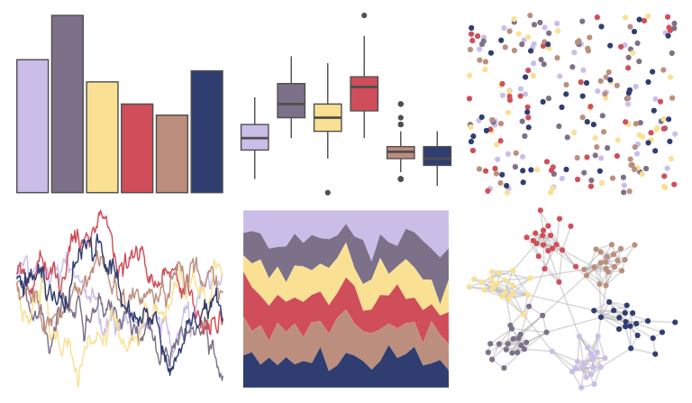

# Manu - Hoiho 

::: columns
::: {.column width="50%"}

**Github**

[G-Thomson/Manu](https://github.com/G-Thomson/Manu)
:::

::: {.column width="50%"}

**CRAN**

Not on CRAN
:::
:::

<hr> 

Use with [paletteer](https://emilhvitfeldt.github.io/paletteer/) package:

```r
library(paletteer)
paletteer_d("Manu::Hoiho")
```

Use raw:

```r
c("#CABEE9FF", "#7C7189FF", "#FAE093FF", "#D04E59FF", "#BC8E7DFF", "#2F3D70FF")
``` 

 

<br>

# Related Palettes

<div class="list" style="display: grid; grid-template-columns: auto auto auto;"> <figure class="figure">
<a href="../../awtools/a_palette/"> </a>
</figure> <figure class="figure">
<a href="../../lisa/JamesJean/"> </a>
</figure> <figure class="figure">
<a href="../../tvthemes/SmokyQuartz/"> </a>
</figure> <figure class="figure">
<a href="../../tayloRswift/lover/"> </a>
</figure> <figure class="figure">
<a href="../../nationalparkcolors/Arches/"> </a>
</figure> <figure class="figure">
<a href="../../nationalparkcolors/ChannelIslands/"> </a>
</figure> <figure class="figure">
<a href="../../futurevisions/kepler16b/"> </a>
</figure> <figure class="figure">
<a href="../../NatParksPalettes/KingsCanyon/"> </a>
</figure> <figure class="figure">
<a href="../../nationalparkcolors/BlueRidgePkwy/"> </a>
</figure> <figure class="figure">
<a href="../../nationalparkcolors/DeathValley/"> </a>
</figure> <figure class="figure">
<a href="../../rtist/raphael/"> </a>
</figure> <figure class="figure">
<a href="../../RColorBrewer/Accent/"> </a>
</figure> 
</div>
