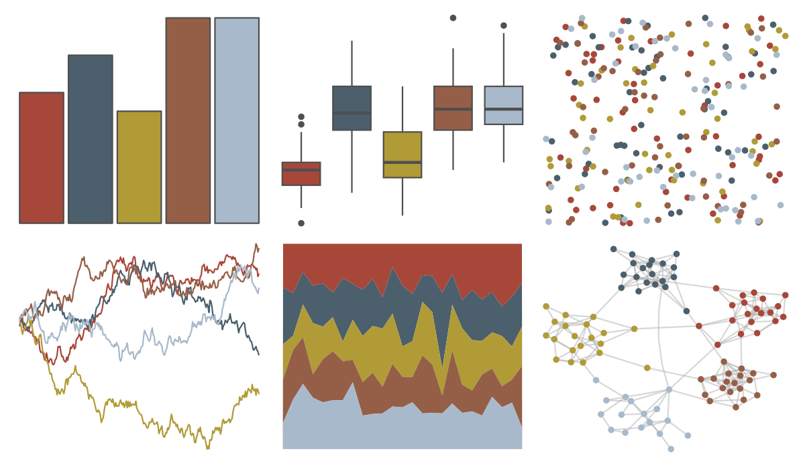

# Manu - Kaka 

::: columns
::: {.column width="50%"}

**Github**

[G-Thomson/Manu](https://github.com/G-Thomson/Manu)
:::

::: {.column width="50%"}

**CRAN**

Not on CRAN
:::
:::

<hr> 

Use with [paletteer](https://emilhvitfeldt.github.io/paletteer/) package:

```r
library(paletteer)
paletteer_d("Manu::Kaka")
```

Use raw:

```r
c("#A7473AFF", "#4B5F6CFF", "#B09B37FF", "#955F47FF", "#A8B9CBFF")
``` 

 

<br>

# Related Palettes

<div class="list" style="display: grid; grid-template-columns: auto auto auto;"> <figure class="figure">
<a href="../../amerika/Dem_Ind_Rep3/"> </a>
</figure> <figure class="figure">
<a href="../../lisa/JacobLawrence/"> </a>
</figure> <figure class="figure">
<a href="../../ghibli/PonyoMedium/"> </a>
</figure> <figure class="figure">
<a href="../../lisa/KarlZerbe/"> </a>
</figure> <figure class="figure">
<a href="../../tayloRswift/taylor1989/"> </a>
</figure> <figure class="figure">
<a href="../../nationalparkcolors/ArcticGates/"> </a>
</figure> <figure class="figure">
<a href="../../NatParksPalettes/KingsCanyon/"> </a>
</figure> <figure class="figure">
<a href="../../Manu/Kotare/"> </a>
</figure> <figure class="figure">
<a href="../../MexBrewer/Alacena/"> </a>
</figure> <figure class="figure">
<a href="../../rockthemes/swift/"> </a>
</figure> <figure class="figure">
<a href="../../rockthemes/harvey/"> </a>
</figure> <figure class="figure">
<a href="../../ochRe/parliament/"> </a>
</figure> 
</div>
