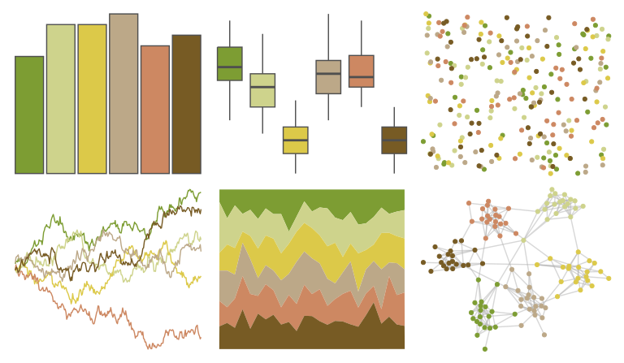

# Manu - Kakapo 

::: columns
::: {.column width="50%"}

**Github**

[G-Thomson/Manu](https://github.com/G-Thomson/Manu)
:::

::: {.column width="50%"}

**CRAN**

Not on CRAN
:::
:::

<hr> 

Use with [paletteer](https://emilhvitfeldt.github.io/paletteer/) package:

```r
library(paletteer)
paletteer_d("Manu::Kakapo")
```

Use raw:

```r
c("#7D9D33FF", "#CED38CFF", "#DCC949FF", "#BCA888FF", "#CD8862FF", "#775B24FF")
``` 

 

<br>

# Related Palettes

<div class="list" style="display: grid; grid-template-columns: auto auto auto;"> <figure class="figure">
<a href="../../awtools/a_palette/"> </a>
</figure> <figure class="figure">
<a href="../../lisa/RemediosVaro/"> </a>
</figure> <figure class="figure">
<a href="../../Manu/Titipounamu/"> </a>
</figure> <figure class="figure">
<a href="../../calecopal/oak/"> </a>
</figure> <figure class="figure">
<a href="../../lisa/JohnQuidor/"> </a>
</figure> <figure class="figure">
<a href="../../beyonce/X23/"> </a>
</figure> <figure class="figure">
<a href="../../ggthemes/excel_Wisp/"> </a>
</figure> <figure class="figure">
<a href="../../colRoz/c_kingii/"> </a>
</figure> <figure class="figure">
<a href="../../ggthemes/excel_Facet/"> </a>
</figure> <figure class="figure">
<a href="../../palettetown/eevee/"> </a>
</figure> <figure class="figure">
<a href="../../rcartocolor/Fall/"> </a>
</figure> <figure class="figure">
<a href="../../NatParksPalettes/Olympic/"> </a>
</figure> 
</div>
