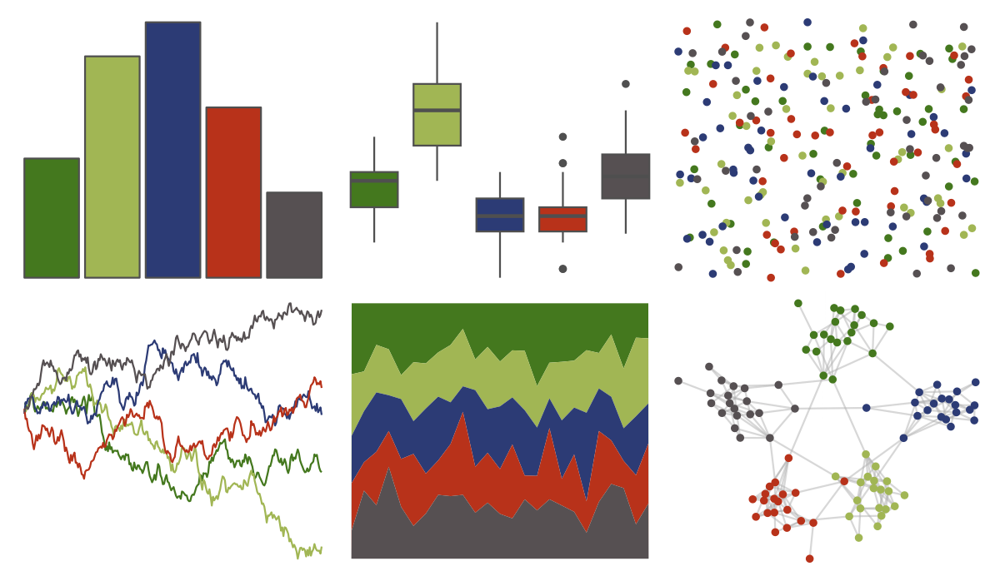

# Manu - Kakariki 

::: columns
::: {.column width="50%"}

**Github**

[G-Thomson/Manu](https://github.com/G-Thomson/Manu)
:::

::: {.column width="50%"}

**CRAN**

Not on CRAN
:::
:::

<hr> 

Use with [paletteer](https://emilhvitfeldt.github.io/paletteer/) package:

```r
library(paletteer)
paletteer_d("Manu::Kakariki")
```

Use raw:

```r
c("#44781EFF", "#A1B654FF", "#2C3B75FF", "#B8321AFF", "#565052FF")
``` 

 

<br>

# Related Palettes

<div class="list" style="display: grid; grid-template-columns: auto auto auto;"> <figure class="figure">
<a href="../../amerika/Dem_Ind_Rep3/"> </a>
</figure> <figure class="figure">
<a href="../../lisa/MaxErnst/"> </a>
</figure> <figure class="figure">
<a href="../../lisa/OdilonRedon/"> </a>
</figure> <figure class="figure">
<a href="../../lisa/PavelTchelitchew/"> </a>
</figure> <figure class="figure">
<a href="../../Manu/Pepetuna/"> </a>
</figure> <figure class="figure">
<a href="../../lisa/OttoDix/"> </a>
</figure> <figure class="figure">
<a href="../../lisa/GeneDavis/"> </a>
</figure> <figure class="figure">
<a href="../../ochRe/lorikeet/"> </a>
</figure> <figure class="figure">
<a href="../../lisa/EdwardHopper/"> </a>
</figure> <figure class="figure">
<a href="../../colRoz/virgo/"> </a>
</figure> <figure class="figure">
<a href="../../waRhol/bighorn_ram_83/"> </a>
</figure> <figure class="figure">
<a href="../../lisa/VincentvanGogh_2/"> </a>
</figure> 
</div>
