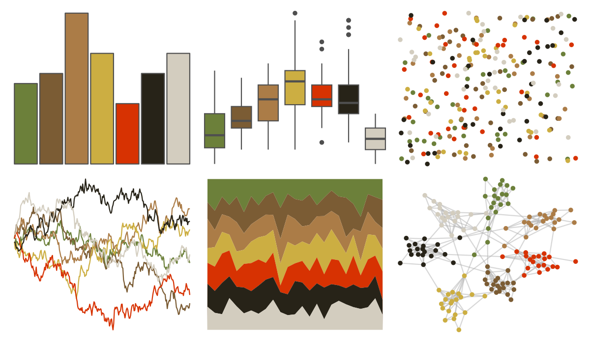
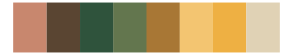

# Manu - Kea 

::: columns
::: {.column width="50%"}

**Github**

[G-Thomson/Manu](https://github.com/G-Thomson/Manu)
:::

::: {.column width="50%"}

**CRAN**

Not on CRAN
:::
:::

<hr> 

Use with [paletteer](https://emilhvitfeldt.github.io/paletteer/) package:

```r
library(paletteer)
paletteer_d("Manu::Kea")
```

Use raw:

```r
c("#6C803AFF", "#7B5C34FF", "#AB7C47FF", "#CCAE42FF", "#D73202FF", "#272318FF", "#D3CDBFFF")
``` 

 

<br>

# Related Palettes

<div class="list" style="display: grid; grid-template-columns: auto auto auto;"> <figure class="figure">
<a href="../../awtools/a_palette/"> </a>
</figure> <figure class="figure">
<a href="../../DresdenColor/sidejobs/"> </a>
</figure> <figure class="figure">
<a href="../../DresdenColor/graveperil/"> </a>
</figure> <figure class="figure">
<a href="../../NatParksPalettes/SmokyMtns/"> </a>
</figure> <figure class="figure">
<a href="../../lisa/FridaKahlo/"> </a>
</figure> <figure class="figure">
<a href="../../fishualize/Pterois_volitans/"> </a>
</figure> <figure class="figure">
<a href="../../tvthemes/parksAndRec/"> </a>
</figure> <figure class="figure">
<a href="../../IslamicArt/fes/"> </a>
</figure> <figure class="figure">
<a href="../../MetBrewer/Paquin/"> </a>
</figure> <figure class="figure">
<a href="../../colRoz/flavolineata/"> </a>
</figure> <figure class="figure">
<a href="../../lisa/GrantWood/"> </a>
</figure> <figure class="figure">
<a href="../../palettetown/swinub/"> </a>
</figure> 
</div>
