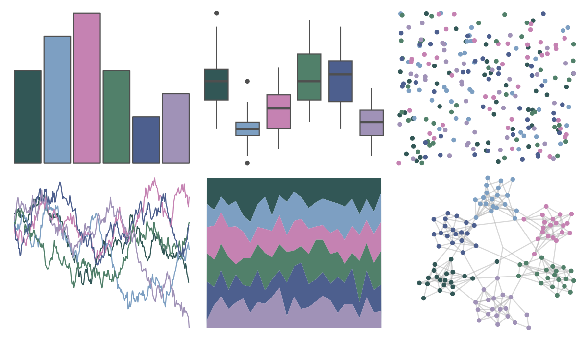

# Manu - Kereru 

::: columns
::: {.column width="50%"}

**Github**

[G-Thomson/Manu](https://github.com/G-Thomson/Manu)
:::

::: {.column width="50%"}

**CRAN**

Not on CRAN
:::
:::

<hr> 

Use with [paletteer](https://emilhvitfeldt.github.io/paletteer/) package:

```r
library(paletteer)
paletteer_d("Manu::Kereru")
```

Use raw:

```r
c("#325756FF", "#7D9FC2FF", "#C582B2FF", "#51806AFF", "#4D5F8EFF", "#A092B7FF")
``` 

 

<br>

# Related Palettes

<div class="list" style="display: grid; grid-template-columns: auto auto auto;"> <figure class="figure">
<a href="../../awtools/a_palette/"> </a>
</figure> <figure class="figure">
<a href="../../NatParksPalettes/Yosemite/"> </a>
</figure> <figure class="figure">
<a href="../../Manu/Kereru_orig/"> </a>
</figure> <figure class="figure">
<a href="../../severance/Half/"> </a>
</figure> <figure class="figure">
<a href="../../Manu/Korora/"> </a>
</figure> <figure class="figure">
<a href="../../NatParksPalettes/RockyMtn/"> </a>
</figure> <figure class="figure">
<a href="../../Redmonder/qMSOPu/"> </a>
</figure> <figure class="figure">
<a href="../../unikn/pal_karpfenblau/"> </a>
</figure> <figure class="figure">
<a href="../../palettetown/muk/"> </a>
</figure> <figure class="figure">
<a href="../../musculusColors/ErMole/"> </a>
</figure> <figure class="figure">
<a href="../../ggthemes/excel_Violet/"> </a>
</figure> <figure class="figure">
<a href="../../ggthemes/excel_Blue_Warm/"> </a>
</figure> 
</div>
