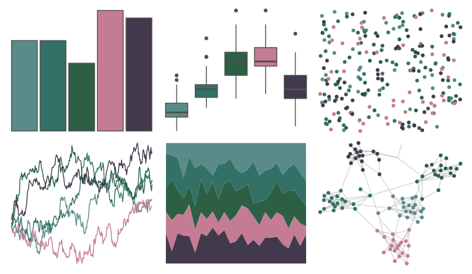

# Manu - Kereru_orig 

::: columns
::: {.column width="50%"}

**Github**

[G-Thomson/Manu](https://github.com/G-Thomson/Manu)
:::

::: {.column width="50%"}

**CRAN**

Not on CRAN
:::
:::

<hr> 

Use with [paletteer](https://emilhvitfeldt.github.io/paletteer/) package:

```r
library(paletteer)
paletteer_d("Manu::Kereru_orig")
```

Use raw:

```r
c("#5A8B8AFF", "#337166FF", "#2C5F44FF", "#C47C94FF", "#43394CFF")
``` 

 

<br>

# Related Palettes

<div class="list" style="display: grid; grid-template-columns: auto auto auto;"> <figure class="figure">
<a href="../../awtools/a_palette/"> </a>
</figure> <figure class="figure">
<a href="../../NatParksPalettes/RockyMtn/"> </a>
</figure> <figure class="figure">
<a href="../../Manu/Kereru/"> </a>
</figure> <figure class="figure">
<a href="../../werpals/cinderella/"> </a>
</figure> <figure class="figure">
<a href="../../severance/Jazz02/"> </a>
</figure> <figure class="figure">
<a href="../../fishualize/Oncorhynchus_gorbuscha/"> </a>
</figure> <figure class="figure">
<a href="../../MetBrewer/Pillement/"> </a>
</figure> <figure class="figure">
<a href="../../NatParksPalettes/Yosemite/"> </a>
</figure> <figure class="figure">
<a href="../../severance/Hell/"> </a>
</figure> <figure class="figure">
<a href="../../Manu/Korora/"> </a>
</figure> <figure class="figure">
<a href="../../DresdenColor/deathmasks/"> </a>
</figure> <figure class="figure">
<a href="../../colRoz/m_oscellata/"> </a>
</figure> 
</div>
