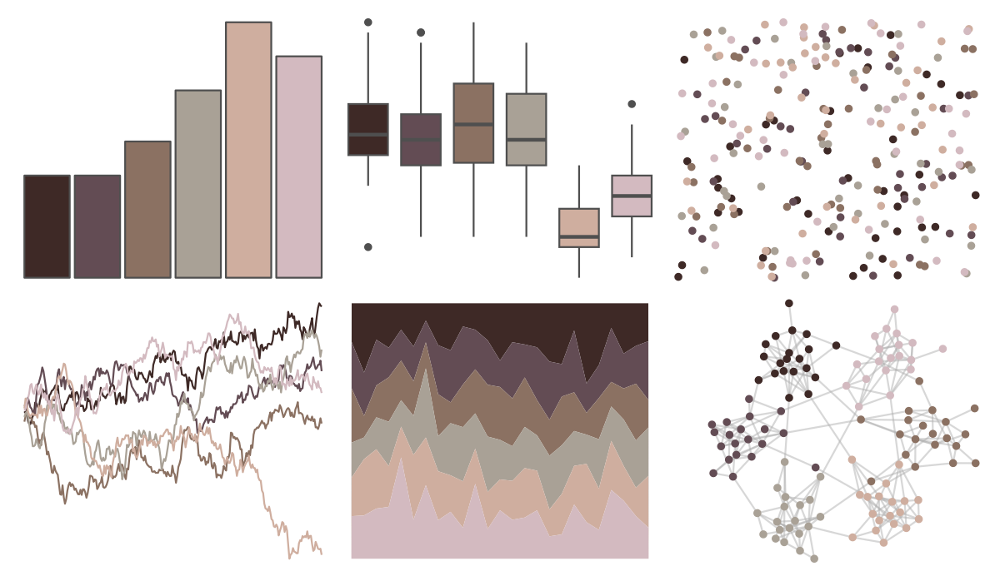
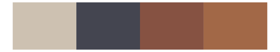
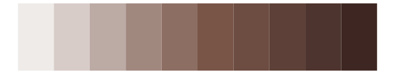

# Manu - Kiwi 

::: columns
::: {.column width="50%"}

**Github**

[G-Thomson/Manu](https://github.com/G-Thomson/Manu)
:::

::: {.column width="50%"}

**CRAN**

Not on CRAN
:::
:::

<hr> 

Use with [paletteer](https://emilhvitfeldt.github.io/paletteer/) package:

```r
library(paletteer)
paletteer_d("Manu::Kiwi")
```

Use raw:

```r
c("#3E2926FF", "#634C54FF", "#8B7162FF", "#A9A196FF", "#CFAE9FFF", "#D3BAC0FF")
``` 

 

<br>

# Related Palettes

<div class="list" style="display: grid; grid-template-columns: auto auto auto;"> <figure class="figure">
<a href="../../awtools/a_palette/"> </a>
</figure> <figure class="figure">
<a href="../../ButterflyColors/hamadryas_feronia/"> </a>
</figure> <figure class="figure">
<a href="../../ButterflyColors/hamadryas_feronia/"> </a>
</figure> <figure class="figure">
<a href="../../nord/halifax_harbor/"> </a>
</figure> <figure class="figure">
<a href="../../calecopal/calochortus/"> </a>
</figure> <figure class="figure">
<a href="../../fishualize/Semicossyphus_pulcher/"> </a>
</figure> <figure class="figure">
<a href="../../rockthemes/swift/"> </a>
</figure> <figure class="figure">
<a href="../../colRoz/t_australis/"> </a>
</figure> <figure class="figure">
<a href="../../fishualize/Sander_lucioperca/"> </a>
</figure> <figure class="figure">
<a href="../../ggsci/brown_material/"> </a>
</figure> <figure class="figure">
<a href="../../tayloRswift/midnightsBloodMoon/"> </a>
</figure> <figure class="figure">
<a href="../../MoMAColors/Picabia/"> </a>
</figure> 
</div>
