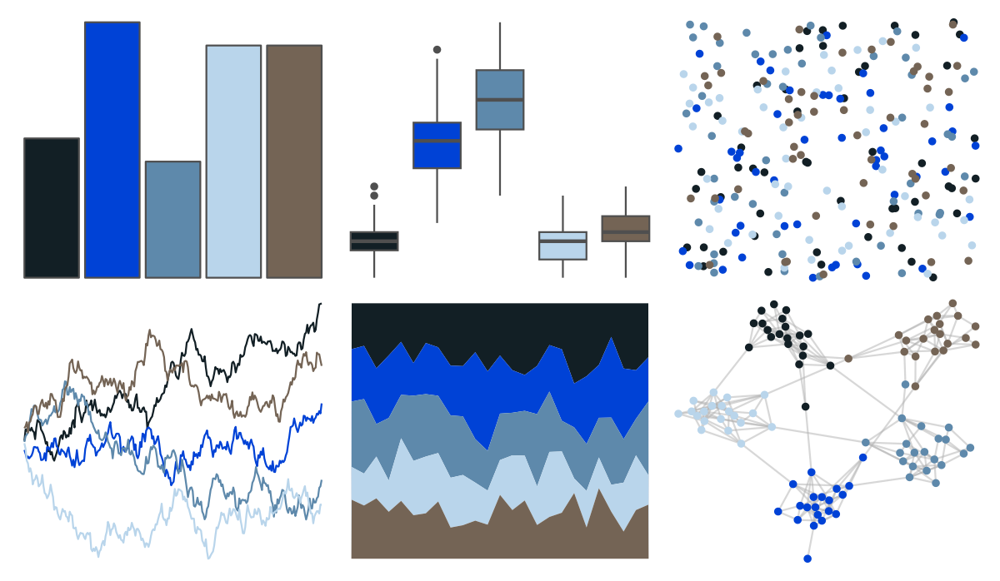

# Manu - Kokako 

::: columns
::: {.column width="50%"}

**Github**

[G-Thomson/Manu](https://github.com/G-Thomson/Manu)
:::

::: {.column width="50%"}

**CRAN**

Not on CRAN
:::
:::

<hr> 

Use with [paletteer](https://emilhvitfeldt.github.io/paletteer/) package:

```r
library(paletteer)
paletteer_d("Manu::Kokako")
```

Use raw:

```r
c("#121F25FF", "#0042D6FF", "#5E89ABFF", "#B9D5EBFF", "#746455FF")
``` 

 

<br>

# Related Palettes

<div class="list" style="display: grid; grid-template-columns: auto auto auto;"> <figure class="figure">
<a href="../../amerika/Dem_Ind_Rep3/"> </a>
</figure> <figure class="figure">
<a href="../../nbapalettes/hornets2/"> </a>
</figure> <figure class="figure">
<a href="../../severance/TheYouYouAre/"> </a>
</figure> <figure class="figure">
<a href="../../yarrr/eternal/"> </a>
</figure> <figure class="figure">
<a href="../../LaCroixColoR/Berry/"> </a>
</figure> <figure class="figure">
<a href="../../futurevisions/europa/"> </a>
</figure> <figure class="figure">
<a href="../../Redmonder/qMSOBuWarm/"> </a>
</figure> <figure class="figure">
<a href="../../MoMAColors/Sidhu/"> </a>
</figure> <figure class="figure">
<a href="../../calecopal/sbchannel/"> </a>
</figure> <figure class="figure">
<a href="../../nbapalettes/hornets_city2/"> </a>
</figure> <figure class="figure">
<a href="../../nord/mountain_forms/"> </a>
</figure> <figure class="figure">
<a href="../../nord/lumina/"> </a>
</figure> 
</div>
