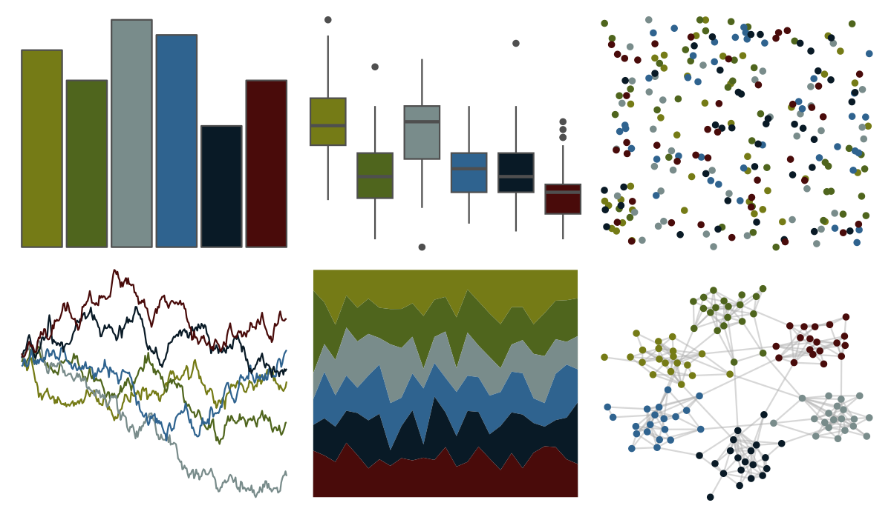

# Manu - Korimako 

::: columns
::: {.column width="50%"}

**Github**

[G-Thomson/Manu](https://github.com/G-Thomson/Manu)
:::

::: {.column width="50%"}

**CRAN**

Not on CRAN
:::
:::

<hr> 

Use with [paletteer](https://emilhvitfeldt.github.io/paletteer/) package:

```r
library(paletteer)
paletteer_d("Manu::Korimako")
```

Use raw:

```r
c("#757B16FF", "#4F651DFF", "#798C8BFF", "#2F638FFF", "#091A26FF", "#490B0AFF")
``` 

 

<br>

# Related Palettes

<div class="list" style="display: grid; grid-template-columns: auto auto auto;"> <figure class="figure">
<a href="../../awtools/a_palette/"> </a>
</figure> <figure class="figure">
<a href="../../severance/Hell/"> </a>
</figure> <figure class="figure">
<a href="../../MetBrewer/Veronese/"> </a>
</figure> <figure class="figure">
<a href="../../ggprism/starry/"> </a>
</figure> <figure class="figure">
<a href="../../nbapalettes/heat_military/"> </a>
</figure> <figure class="figure">
<a href="../../nbapalettes/mavericks_alt/"> </a>
</figure> <figure class="figure">
<a href="../../calecopal/sierra1/"> </a>
</figure> <figure class="figure">
<a href="../../severance/Jazz02/"> </a>
</figure> <figure class="figure">
<a href="../../peRReo/eminem/"> </a>
</figure> <figure class="figure">
<a href="../../futurevisions/jupiter/"> </a>
</figure> <figure class="figure">
<a href="../../colRoz/capricorn/"> </a>
</figure> <figure class="figure">
<a href="../../ochRe/nolan_ned/"> </a>
</figure> 
</div>
