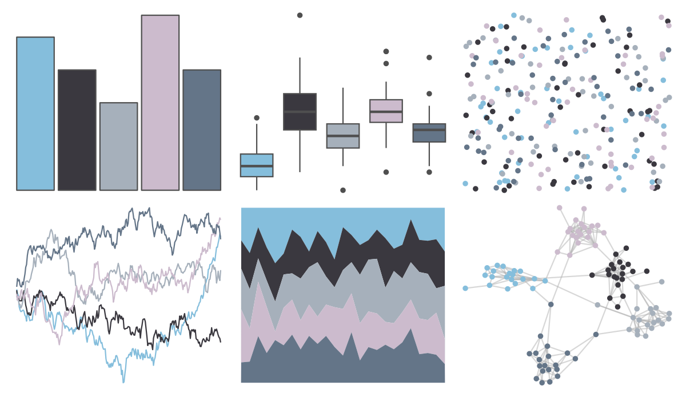

# Manu - Korora 

::: columns
::: {.column width="50%"}

**Github**

[G-Thomson/Manu](https://github.com/G-Thomson/Manu)
:::

::: {.column width="50%"}

**CRAN**

Not on CRAN
:::
:::

<hr> 

Use with [paletteer](https://emilhvitfeldt.github.io/paletteer/) package:

```r
library(paletteer)
paletteer_d("Manu::Korora")
```

Use raw:

```r
c("#85BEDCFF", "#3A383FFF", "#A6B0BBFF", "#CCBBCDFF", "#647588FF")
``` 

 

<br>

# Related Palettes

<div class="list" style="display: grid; grid-template-columns: auto auto auto;"> <figure class="figure">
<a href="../../amerika/Dem_Ind_Rep3/"> </a>
</figure> <figure class="figure">
<a href="../../Redmonder/qMSOPu/"> </a>
</figure> <figure class="figure">
<a href="../../vangogh/Landscape/"> </a>
</figure> <figure class="figure">
<a href="../../Manu/Kereru/"> </a>
</figure> <figure class="figure">
<a href="../../musculusColors/Bmsurface/"> </a>
</figure> <figure class="figure">
<a href="../../DresdenColor/deathmasks/"> </a>
</figure> <figure class="figure">
<a href="../../severance/Half/"> </a>
</figure> <figure class="figure">
<a href="../../nord/baie_mouton/"> </a>
</figure> <figure class="figure">
<a href="../../fishualize/Mycteroperca_bonaci/"> </a>
</figure> <figure class="figure">
<a href="../../ButterflyColors/pseudolycaena_marsyas/"> </a>
</figure> <figure class="figure">
<a href="../../palettetown/muk/"> </a>
</figure> <figure class="figure">
<a href="../../fishualize/Opisthonema_oglinum/"> </a>
</figure> 
</div>
