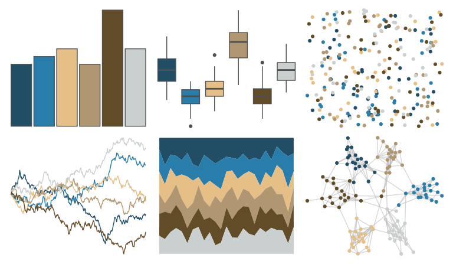

# Manu - Kotare 

::: columns
::: {.column width="50%"}

**Github**

[G-Thomson/Manu](https://github.com/G-Thomson/Manu)
:::

::: {.column width="50%"}

**CRAN**

Not on CRAN
:::
:::

<hr> 

Use with [paletteer](https://emilhvitfeldt.github.io/paletteer/) package:

```r
library(paletteer)
paletteer_d("Manu::Kotare")
```

Use raw:

```r
c("#214D65FF", "#287DABFF", "#E5BF86FF", "#B09771FF", "#624B27FF", "#CACFD0FF")
``` 

 

<br>

# Related Palettes

<div class="list" style="display: grid; grid-template-columns: auto auto auto;"> <figure class="figure">
<a href="../../awtools/a_palette/"> </a>
</figure> <figure class="figure">
<a href="../../NatParksPalettes/KingsCanyon/"> </a>
</figure> <figure class="figure">
<a href="../../IslamicArt/alhambra/"> </a>
</figure> <figure class="figure">
<a href="../../nationalparkcolors/CraterLake/"> </a>
</figure> <figure class="figure">
<a href="../../ggprism/waves2/"> </a>
</figure> <figure class="figure">
<a href="../../calecopal/bigsur/"> </a>
</figure> <figure class="figure">
<a href="../../calecopal/bigsur2/"> </a>
</figure> <figure class="figure">
<a href="../../colRoz/c_decresii/"> </a>
</figure> <figure class="figure">
<a href="../../lisa/KarlZerbe/"> </a>
</figure> <figure class="figure">
<a href="../../ochRe/parliament/"> </a>
</figure> <figure class="figure">
<a href="../../colRoz/salt_lake/"> </a>
</figure> <figure class="figure">
<a href="../../nord/baie_mouton/"> </a>
</figure> 
</div>
