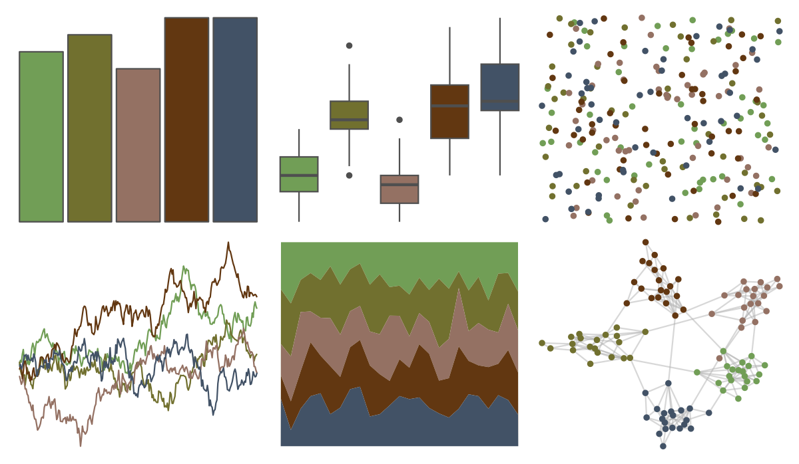

# Manu - Pepetuna 

::: columns
::: {.column width="50%"}

**Github**

[G-Thomson/Manu](https://github.com/G-Thomson/Manu)
:::

::: {.column width="50%"}

**CRAN**

Not on CRAN
:::
:::

<hr> 

Use with [paletteer](https://emilhvitfeldt.github.io/paletteer/) package:

```r
library(paletteer)
paletteer_d("Manu::Pepetuna")
```

Use raw:

```r
c("#719E56FF", "#71702FFF", "#947163FF", "#623711FF", "#425266FF")
``` 

 

<br>

# Related Palettes

<div class="list" style="display: grid; grid-template-columns: auto auto auto;"> <figure class="figure">
<a href="../../awtools/a_palette/"> </a>
</figure> <figure class="figure">
<a href="../../lisa/Michelangelo/"> </a>
</figure> <figure class="figure">
<a href="../../lisa/MaxErnst/"> </a>
</figure> <figure class="figure">
<a href="../../lisa/OdilonRedon/"> </a>
</figure> <figure class="figure">
<a href="../../suffrager/chelsea/"> </a>
</figure> <figure class="figure">
<a href="../../colRoz/k_tristis/"> </a>
</figure> <figure class="figure">
<a href="../../Manu/Kakariki/"> </a>
</figure> <figure class="figure">
<a href="../../lisa/OttoDix/"> </a>
</figure> <figure class="figure">
<a href="../../calecopal/bigsur2/"> </a>
</figure> <figure class="figure">
<a href="../../calecopal/sierra1/"> </a>
</figure> <figure class="figure">
<a href="../../lisa/SalvadorDali/"> </a>
</figure> <figure class="figure">
<a href="../../NatParksPalettes/GrandCanyon/"> </a>
</figure> 
</div>
