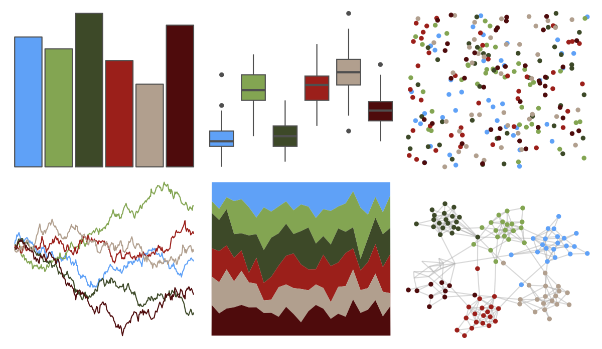

# Manu - Pohutukawa 

::: columns
::: {.column width="50%"}

**Github**

[G-Thomson/Manu](https://github.com/G-Thomson/Manu)
:::

::: {.column width="50%"}

**CRAN**

Not on CRAN
:::
:::

<hr> 

Use with [paletteer](https://emilhvitfeldt.github.io/paletteer/) package:

```r
library(paletteer)
paletteer_d("Manu::Pohutukawa")
```

Use raw:

```r
c("#5FA1F7FF", "#83A552FF", "#3D4928FF", "#9B1F1AFF", "#B19F8EFF", "#4E0B0CFF")
``` 

 

<br>

# Related Palettes

<div class="list" style="display: grid; grid-template-columns: auto auto auto;"> <figure class="figure">
<a href="../../awtools/a_palette/"> </a>
</figure> <figure class="figure">
<a href="../../MetBrewer/Degas/"> </a>
</figure> <figure class="figure">
<a href="../../lisa/ClaudeMonet/"> </a>
</figure> <figure class="figure">
<a href="../../lisa/MiltonAvery/"> </a>
</figure> <figure class="figure">
<a href="../../lisa/PavelTchelitchew/"> </a>
</figure> <figure class="figure">
<a href="../../lisa/JohannesVermeer_1/"> </a>
</figure> <figure class="figure">
<a href="../../colRoz/xantho/"> </a>
</figure> <figure class="figure">
<a href="../../tayloRswift/taylorRed/"> </a>
</figure> <figure class="figure">
<a href="../../fishualize/Serranus_baldwini/"> </a>
</figure> <figure class="figure">
<a href="../../colRoz/virgo/"> </a>
</figure> <figure class="figure">
<a href="../../rockthemes/faithnomore/"> </a>
</figure> <figure class="figure">
<a href="../../lisa/GiorgiodeChirico/"> </a>
</figure> 
</div>
