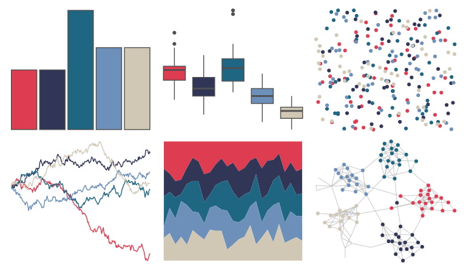

# Manu - Takahe 

::: columns
::: {.column width="50%"}

**Github**

[G-Thomson/Manu](https://github.com/G-Thomson/Manu)
:::

::: {.column width="50%"}

**CRAN**

Not on CRAN
:::
:::

<hr> 

Use with [paletteer](https://emilhvitfeldt.github.io/paletteer/) package:

```r
library(paletteer)
paletteer_d("Manu::Takahe")
```

Use raw:

```r
c("#DD3C51FF", "#313657FF", "#1F6683FF", "#6C90B9FF", "#D1C7B5FF")
``` 

 

<br>

# Related Palettes

<div class="list" style="display: grid; grid-template-columns: auto auto auto;"> <figure class="figure">
<a href="../../awtools/a_palette/"> </a>
</figure> <figure class="figure">
<a href="../../nbapalettes/wizards_earned/"> </a>
</figure> <figure class="figure">
<a href="../../fishualize/Hypsoblennius_invemar/"> </a>
</figure> <figure class="figure">
<a href="../../calecopal/tidepool/"> </a>
</figure> <figure class="figure">
<a href="../../MetBrewer/Thomas/"> </a>
</figure> <figure class="figure">
<a href="../../rockthemes/californication/"> </a>
</figure> <figure class="figure">
<a href="../../colRoz/salt_lake/"> </a>
</figure> <figure class="figure">
<a href="../../ghibli/SpiritedMedium/"> </a>
</figure> <figure class="figure">
<a href="../../fishualize/Oncorhynchus_nerka/"> </a>
</figure> <figure class="figure">
<a href="../../lisa/EdouardManet/"> </a>
</figure> <figure class="figure">
<a href="../../lisa/ClaudeMonet_1/"> </a>
</figure> <figure class="figure">
<a href="../../nbapalettes/sixers_city/"> </a>
</figure> 
</div>
