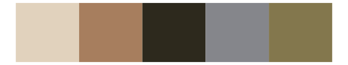
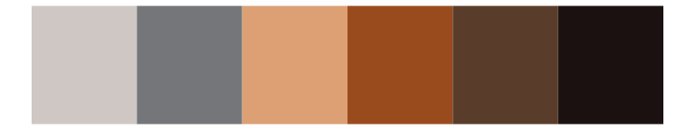

# Manu - Takapu 

::: columns
::: {.column width="50%"}

**Github**

[G-Thomson/Manu](https://github.com/G-Thomson/Manu)
:::

::: {.column width="50%"}

**CRAN**

Not on CRAN
:::
:::

<hr> 

Use with [paletteer](https://emilhvitfeldt.github.io/paletteer/) package:

```r
library(paletteer)
paletteer_d("Manu::Takapu")
```

Use raw:

```r
c("#DEB478FF", "#976533FF", "#D3D5D0FF", "#76716EFF", "#272623FF")
``` 

 

<br>

# Related Palettes

<div class="list" style="display: grid; grid-template-columns: auto auto auto;"> <figure class="figure">
<a href="../../amerika/Dem_Ind_Rep3/"> </a>
</figure> <figure class="figure">
<a href="../../wesanderson/Moonrise2/"> </a>
</figure> <figure class="figure">
<a href="../../lisa/LucianFreud/"> </a>
</figure> <figure class="figure">
<a href="../../lisa/EdgarDegas/"> </a>
</figure> <figure class="figure">
<a href="../../colRoz/p_cincta/"> </a>
</figure> <figure class="figure">
<a href="../../rtist/degas/"> </a>
</figure> <figure class="figure">
<a href="../../tayloRswift/evermore/"> </a>
</figure> <figure class="figure">
<a href="../../wesanderson/IsleofDogs1/"> </a>
</figure> <figure class="figure">
<a href="../../vangogh/Cypresses/"> </a>
</figure> <figure class="figure">
<a href="../../DresdenColor/stormfront/"> </a>
</figure> <figure class="figure">
<a href="../../poisonfrogs/Pvaillantii/"> </a>
</figure> <figure class="figure">
<a href="../../lisa/Pierre_AugusteRenoir_1/"> </a>
</figure> 
</div>
