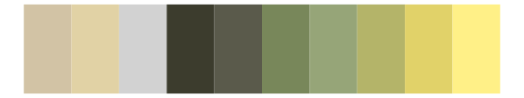

# Manu - Titipounamu 

::: columns
::: {.column width="50%"}

**Github**

[G-Thomson/Manu](https://github.com/G-Thomson/Manu)
:::

::: {.column width="50%"}

**CRAN**

Not on CRAN
:::
:::

<hr> 

Use with [paletteer](https://emilhvitfeldt.github.io/paletteer/) package:

```r
library(paletteer)
paletteer_d("Manu::Titipounamu")
```

Use raw:

```r
c("#3E4331FF", "#AD6B17FF", "#66743BFF", "#D0C471FF", "#CCB62FFF", "#BAC4C2FF")
``` 

 

<br>

# Related Palettes

<div class="list" style="display: grid; grid-template-columns: auto auto auto;"> <figure class="figure">
<a href="../../awtools/a_palette/"> </a>
</figure> <figure class="figure">
<a href="../../IslamicArt/fes/"> </a>
</figure> <figure class="figure">
<a href="../../palettetown/shedinja/"> </a>
</figure> <figure class="figure">
<a href="../../fishualize/Hemitaurichthys_polylepis/"> </a>
</figure> <figure class="figure">
<a href="../../fishualize/Oncorhynchus_mykiss/"> </a>
</figure> <figure class="figure">
<a href="../../lisa/RemediosVaro/"> </a>
</figure> <figure class="figure">
<a href="../../ggthemes/excel_Wisp/"> </a>
</figure> <figure class="figure">
<a href="../../Manu/Kakapo/"> </a>
</figure> <figure class="figure">
<a href="../../palettetown/graveler/"> </a>
</figure> <figure class="figure">
<a href="../../impressionist.colors/melon_et_peches/"> </a>
</figure> <figure class="figure">
<a href="../../palettetown/geodude/"> </a>
</figure> <figure class="figure">
<a href="../../rcartocolor/Fall/"> </a>
</figure> 
</div>
