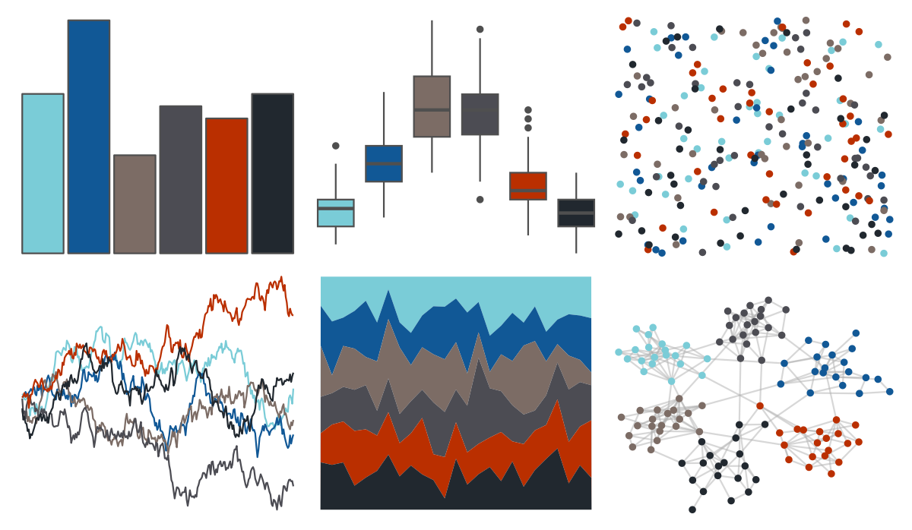

# Manu - Tui 

::: columns
::: {.column width="50%"}

**Github**

[G-Thomson/Manu](https://github.com/G-Thomson/Manu)
:::

::: {.column width="50%"}

**CRAN**

Not on CRAN
:::
:::

<hr> 

Use with [paletteer](https://emilhvitfeldt.github.io/paletteer/) package:

```r
library(paletteer)
paletteer_d("Manu::Tui")
```

Use raw:

```r
c("#7ACCD7FF", "#115896FF", "#7C6C65FF", "#4C4C53FF", "#BA2F00FF", "#21282FFF")
``` 

 

<br>

# Related Palettes

<div class="list" style="display: grid; grid-template-columns: auto auto auto;"> <figure class="figure">
<a href="../../amerika/Dem_Ind_Rep3/"> </a>
</figure> <figure class="figure">
<a href="../../MoMAColors/Sidhu/"> </a>
</figure> <figure class="figure">
<a href="../../ggthemr/sky/"> </a>
</figure> <figure class="figure">
<a href="../../MoMAColors/Picasso/"> </a>
</figure> <figure class="figure">
<a href="../../severance/TheYouYouAre/"> </a>
</figure> <figure class="figure">
<a href="../../NatParksPalettes/Triglav/"> </a>
</figure> <figure class="figure">
<a href="../../MetBrewer/Moreau/"> </a>
</figure> <figure class="figure">
<a href="../../ButterflyColors/morpho_helenor/"> </a>
</figure> <figure class="figure">
<a href="../../nbapalettes/clippers_city/"> </a>
</figure> <figure class="figure">
<a href="../../nbapalettes/heat_military/"> </a>
</figure> <figure class="figure">
<a href="../../DresdenColor/foolmoon/"> </a>
</figure> <figure class="figure">
<a href="../../ggthemr/fresh/"> </a>
</figure> 
</div>
