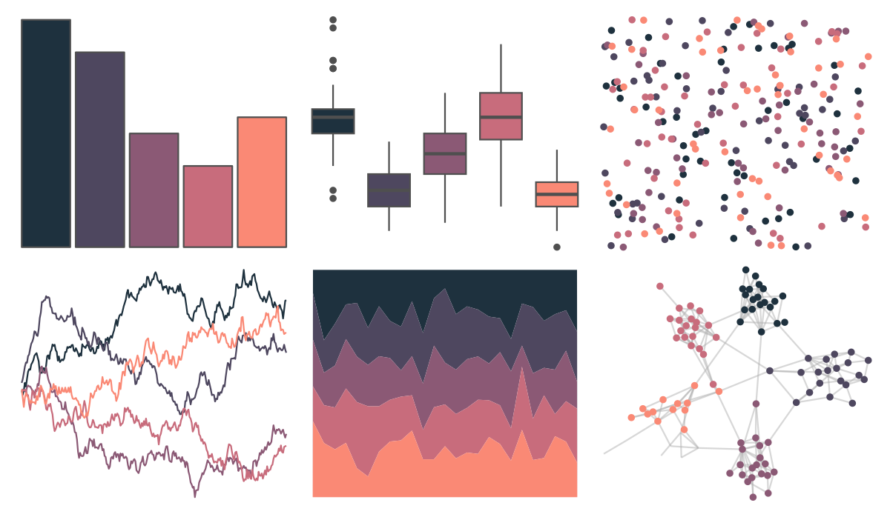

# MapPalettes - bruiser 

::: columns
::: {.column width="50%"}

**Github**

[disarm-platform/MapPalettes](https://github.com/disarm-platform/MapPalettes)
:::

::: {.column width="50%"}

**CRAN**

Not on CRAN
:::
:::

<hr> 

Use with [paletteer](https://emilhvitfeldt.github.io/paletteer/) package:

```r
library(paletteer)
paletteer_d("MapPalettes::bruiser")
```

Use raw:

```r
c("#1E313EFF", "#4E475FFF", "#8B5975FF", "#C86C7CFF", "#FA8975FF")
``` 

 

<br>

# Related Palettes

<div class="list" style="display: grid; grid-template-columns: auto auto auto;"> <figure class="figure">
<a href="../../amerika/Dem_Ind_Rep3/"> </a>
</figure> <figure class="figure">
<a href="../../beyonce/X14/"> </a>
</figure> <figure class="figure">
<a href="../../PNWColors/Starfish/"> </a>
</figure> <figure class="figure">
<a href="../../MoMAColors/Palermo/"> </a>
</figure> <figure class="figure">
<a href="../../tayloRswift/speakNowTV/"> </a>
</figure> <figure class="figure">
<a href="../../NineteenEightyR/cobra/"> </a>
</figure> <figure class="figure">
<a href="../../beyonce/X27/"> </a>
</figure> <figure class="figure">
<a href="../../unikn/pal_bordeaux/"> </a>
</figure> <figure class="figure">
<a href="../../calecopal/vermillion/"> </a>
</figure> <figure class="figure">
<a href="../../Redmonder/sPBIRdPu/"> </a>
</figure> <figure class="figure">
<a href="../../rcartocolor/Burg/"> </a>
</figure> <figure class="figure">
<a href="../../lisa/Masaccio/"> </a>
</figure> 
</div>
